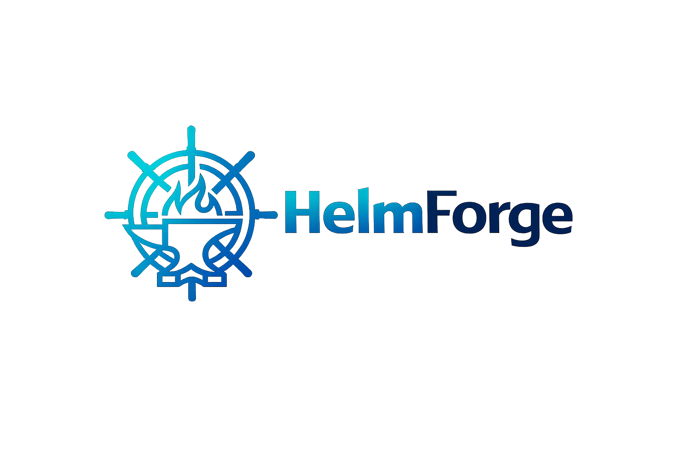

<p align="center">
  
</p>

<h1 align="center">HelmForge Charts</h1>

<p align="center">
  Production-ready Helm charts for modern Kubernetes workloads.
</p>

<p align="center">
  <a href="https://github.com/helmforgedev/charts/actions/workflows/ci.yml"></a>
  <a href="https://github.com/helmforgedev/charts/actions/workflows/publish.yml"></a>
  <a href="https://opensource.org/licenses/MIT"></a>
  <a href="https://artifacthub.io/packages/search?repo=helmforge"></a>
  
  =1.26" />
  <a href="CONTRIBUTING.md"></a>
</p>

<p align="center">
  <a href="https://helmforge.dev">Website</a> · <a href="https://helmforge.dev/doc">Documentation</a> · <a href="https://repo.helmforge.dev">Helm Repository</a> · <a href="CONTRIBUTING.md">Contributing</a>
</p>

## Quick Start

### HTTPS repository

```bash
helm repo add helmforge https://repo.helmforge.dev
helm repo update
helm search repo helmforge/
helm install <release-name> helmforge/<chart-name> --version <version> -f values.yaml
```

### OCI registry

```bash
helm install <release-name> oci://ghcr.io/helmforgedev/helm/<chart-name> --version <version> -f values.yaml

# Show default values
helm show values oci://ghcr.io/helmforgedev/helm/<chart-name> --version <version>
```

Check each chart's README and [git tags](../../tags) for available versions.

## Charts

| Chart | Maturity | Description |
|-------|----------|-------------|
| [generic](charts/generic/) | stable | General-purpose chart for any Kubernetes workload |
| [mongodb](charts/mongodb/) | stable | MongoDB — standalone, replica set, or sharded cluster |
| [redis](charts/redis/) | stable | Redis — standalone, replication, sentinel, or cluster |
| [rabbitmq](charts/rabbitmq/) | stable | RabbitMQ — single-node or cluster with management UI and optional TLS |
| [postgresql](charts/postgresql/) | stable | PostgreSQL — standalone or fixed-primary replication with optional metrics |
| [mysql](charts/mysql/) | stable | MySQL — standalone or fixed-source replication with optional metrics |
| [keycloak](charts/keycloak/) | stable | Keycloak — dev or production mode with external DB and separated management service |
| [vaultwarden](charts/vaultwarden/) | stable | Vaultwarden — single-instance with persistent SQLite, ingress, and optional SMTP |
| [minecraft](charts/minecraft/) | stable | Minecraft — Java Edition server with Vanilla, Paper, Forge, Fabric, GeyserMC cross-play, S3 backup, and monitoring |
| [pihole](charts/pihole/) | stable | Pi-hole — DNS sinkhole with custom records, Unbound recursive DNS, and Prometheus metrics |
| [wordpress](charts/wordpress/) | stable | WordPress — CMS with MySQL subchart or external database, S3 backup, and Prometheus metrics |
| [strapi](charts/strapi/) | stable | Strapi — headless CMS with SQLite, PostgreSQL, or MySQL, uploads persistence, and S3 backup |
| [answer](charts/answer/) | stable | Apache Answer — Q&A platform with SQLite, PostgreSQL, or MySQL, auto-install, and S3 backup |
| [n8n](charts/n8n/) | stable | n8n — workflow automation with SQLite, PostgreSQL, or MySQL, Redis queue mode, and S3 backup |
| [komga](charts/komga/) | stable | Komga — media server for comics and manga with OPDS, SQLite persistence, and S3 backup |
| [guacamole](charts/guacamole/) | stable | Apache Guacamole — remote desktop gateway with guacd, PostgreSQL or MySQL, OIDC/SAML SSO, and S3 backup |
| [cloudflared](charts/cloudflared/) | stable | Cloudflare Tunnel — secure outbound-only connections with HA, PDB, and Prometheus metrics |
| [ddns-updater](charts/ddns-updater/) | stable | DDNS Updater — dynamic DNS for 50+ providers with web UI and persistent history |
| [dolibarr](charts/dolibarr/) | stable | Dolibarr — ERP/CRM with MySQL or MariaDB, unattended setup, and persistent business data |
| [docmost](charts/docmost/) | stable | Docmost — collaborative wiki and documentation software with PostgreSQL, Redis, local storage, and optional S3 |
| [flowise](charts/flowise/) | stable | Flowise — visual AI orchestration with standalone SQLite mode or scalable queue mode backed by Redis and PostgreSQL |
| [mosquitto](charts/mosquitto/) | stable | Eclipse Mosquitto — MQTT broker with standalone or federated topology, WebSocket support, and optional MQTTX Web companion UI |
| [uptime-kuma](charts/uptime-kuma/) | stable | Uptime Kuma — self-hosted monitoring with SQLite or MariaDB, status pages, and S3 backup |
| [authelia](charts/authelia/) | stable | Authelia — SSO, MFA, and OpenID Connect authentication server with forward auth for reverse proxies |
| [adguard-home](charts/adguard-home/) | stable | AdGuard Home — network-wide DNS ad/tracker blocker with sync and S3 backup |
| [appwrite](charts/appwrite/) | stable | Appwrite — self-hosted BaaS with API, console, realtime, workers, MariaDB, and Redis |
| [velero](charts/velero/) | stable | Velero — Kubernetes backup, restore, migration, schedules, and S3-compatible object storage |
| [kafka](charts/kafka/) | stable | Kafka — KRaft single-broker and production-oriented cluster modes with persistent storage and optional metrics |
| [phpmyadmin](charts/phpmyadmin/) | stable | phpMyAdmin — web-based MySQL/MariaDB administration with multi-server, auto-login, and custom config support |
| [heimdall](charts/heimdall/) | stable | Heimdall — application dashboard with persistent config, S3 backup, and ingress support |
| [gitea](charts/gitea/) | stable | Gitea — self-hosted Git service with SQLite, PostgreSQL, or MySQL, rootless image, SSH, and S3 backup |
| [homarr](charts/homarr/) | stable | Homarr — modern application dashboard with SQLite, PostgreSQL, or MySQL, Kubernetes integration, and S3 backup |
| [mariadb](charts/mariadb/) | stable | MariaDB — standalone or GTID-based replication with TLS, metrics, configuration presets, and S3 backup |

### Maturity levels

| Level | Meaning | Criteria |
|-------|---------|----------|
| **stable** | Production-ready, well-tested | 1+ releases, CI scenarios, k3d validated, no recent breaking changes |
| **beta** | Functional, iterating | 1+ releases, unit tests and CI present, may have minor gaps |
| **alpha** | New, functional but early | No release yet, tests present, limited iteration |

## CI/CD

Charts are automatically tested and published via two GitHub Actions workflows.

```text
PR        --> ci.yml      --> [Lint] [Template] [Kubeconform]
Push main --> publish.yml --> Detect --> Semver --> Package --> Publish to GHCR + Pages --> Git tag
```

Both workflows dynamically detect which charts changed and run jobs only for those charts using a matrix strategy. Changes to docs (`README.md`, `examples/`, `docs/`) are ignored.

### Versioning

Versions are calculated automatically from Conventional Commits affecting each chart.

| Commit prefix | Bump | Example |
|---------------|------|---------|
| `fix:`, `docs:`, `refactor:` | PATCH | `fix(generic): correct HPA indentation` |
| `feat:` | MINOR | `feat(generic): add DaemonSet support` |
| `feat!:` or `BREAKING CHANGE` | MAJOR | `feat(generic)!: restructure workload config` |

Tags follow the format `{chart}-v{version}` (for example `generic-v1.2.3`).

### Release Notes

Every chart release automatically creates a [GitHub Release](https://github.com/helmforgedev/charts/releases) with categorized notes generated from Conventional Commits:

- **Breaking Changes** — commits with `!:` or `BREAKING CHANGE`
- **Features** — `feat(...):`
- **Bug Fixes** — `fix(...):`
- **Other Changes** — `docs`, `refactor`, `ci`, etc.

Each release includes install instructions for both OCI and Helm repository.

### Testing

Each chart includes a `ci/` directory with test values files. The pipeline runs `helm template` against every `ci/*.yaml` file automatically, in addition to default values, lint, and kubeconform schema validation.

### Kubernetes Compatibility

All charts require **Helm 3** (`apiVersion: v2`) and target **Kubernetes 1.26+**.

| Kubernetes Version | Status |
|--------------------|--------|
| 1.26.x | Supported (minimum) |
| 1.27.x | Supported |
| 1.28.x | Supported |
| 1.29.x | Supported |
| 1.30.x | Supported |
| 1.31.x | Supported |
| 1.32.x | Supported |
| 1.33.x | Supported |
| 1.34.x | Supported |
| 1.35.x | Supported |

CI validates rendered manifests with [kubeconform](https://github.com/yannh/kubeconform) against the default Kubernetes JSON schemas. Local validation uses [k3d](https://k3d.io/) clusters.

Charts use standard stable APIs (`apps/v1`, `batch/v1`, `networking.k8s.io/v1`) and avoid alpha/beta API versions to maximize compatibility.

## Contributing

Contributions are welcome. Please read the [contributing guide](CONTRIBUTING.md) for branch flow, validation requirements, commit conventions, and chart standards.

## License

MIT

<!-- @AI-METADATA
type: overview
title: HelmForge Charts
description: Helm chart repository overview, installation, charts list, and CI/CD

keywords: helm, charts, oci, ghcr, repository, install

purpose: Repository overview with charts list, installation, CI/CD, and contributing guide
scope: Repository

relations:
  - .claude/AGENTS.md
  - docs/testing-strategy.md
path: README.md
version: 1.0
date: 2026-04-01
-->
