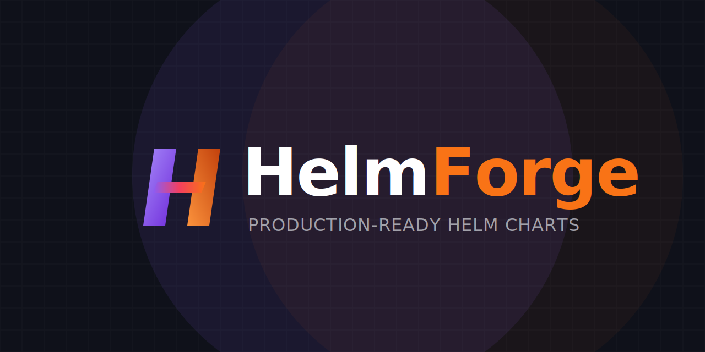

<p align="center">
  
</p>

<h1 align="center">HelmForge Charts</h1>

<p align="center">
  Production-ready Helm charts for self-hosted and platform workloads.
</p>

<p align="center">
  <a href="https://github.com/helmforgedev/charts/actions/workflows/ci.yml"></a>
  <a href="https://github.com/helmforgedev/charts/actions/workflows/publish.yml"></a>
  <a href="https://github.com/helmforgedev/charts/stargazers"></a>
  <a href="https://opensource.org/licenses/MIT"></a>
  <a href="https://artifacthub.io/packages/search?repo=helmforge"></a>
  
  
  
  =1.26" />
  <a href="https://github.com/helmforgedev/charts/issues"></a>
  <a href="https://github.com/helmforgedev/charts/pulls"></a>
  <a href="https://github.com/helmforgedev/charts/commits/main"></a>
  <a href="CONTRIBUTING.md"></a>
</p>

<p align="center">
  <a href="https://helmforge.dev">Website</a> · <a href="https://helmforge.dev/docs">Documentation</a> · <a href="https://repo.helmforge.dev">Helm Repository</a> · <a href="CONTRIBUTING.md">Contributing</a>
</p>

## Quick Start

HelmForge publishes charts through both a standard HTTPS Helm repository and an OCI registry on GHCR. Use the HTTPS repository when you want classic `helm repo` workflows, and OCI when you prefer registry-native pulls and signatures.

### HTTPS repository

```bash
helm repo add helmforge https://repo.helmforge.dev
helm repo update
helm search repo helmforge/
helm install <release-name> helmforge/<chart-name> --version <version> -f values.yaml
```

### OCI registry

```bash
helm install <release-name> oci://ghcr.io/helmforgedev/helm/<chart-name> --version <version> -f values.yaml

# Show default values
helm show values oci://ghcr.io/helmforgedev/helm/<chart-name> --version <version>
```

Check each chart's README and [git tags](../../tags) for available versions.

### Verify a packaged chart

Every published chart package is signed with GPG provenance, and OCI artifacts are signed with Cosign by the release workflow. Import the HelmForge public key before using Helm provenance verification.

```bash
# HTTPS repository provenance verification
helm pull helmforge/<chart-name> --version <version> --verify

# OCI signature verification
cosign verify \
  --certificate-oidc-issuer https://token.actions.githubusercontent.com \
  --certificate-identity-regexp 'https://github.com/helmforgedev/charts/.github/workflows/publish.yml@refs/heads/main' \
  ghcr.io/helmforgedev/helm/<chart-name>:<version>
```

## Why HelmForge

HelmForge is built on a simple principle: **use what upstream ships, make the Kubernetes contract explicit, and keep releases verifiable**.

- **Official upstream images** — charts prefer images published by the application maintainers. No proprietary rebuild layer or vendor-specific runtime wrapper.
- **Pinned version tags** — charts reference explicit, immutable image tags. No `:latest`, no floating tags, no surprises after a pull.
- **MIT licensed** — the charts, tests, and docs are MIT. No open-core, no paid tiers, no license changes down the road.
- **GPG + Cosign signed** — every release includes GPG provenance files for Helm verification and [Sigstore Cosign](https://www.sigstore.dev/) keyless signatures on OCI artifacts via GitHub Actions OIDC.
- **No vendor lock-in** — standard Helm, standard Kubernetes APIs, standard images. If you stop using HelmForge tomorrow, nothing breaks.
- **Explicit values contracts** — product-oriented `values.yaml` files map directly to application and Kubernetes configuration, with schemas and validations where they prevent bad releases.
- **Operator-first docs** — chart READMEs, site docs, examples, and test values are kept close to the release surface.

## Charts

60+ production-ready charts covering databases, authentication, CMS, analytics, automation, AI tooling, observability, and platform infrastructure. The repository currently contains 62 chart packages.

Browse the full catalog with descriptions, install commands, and playground configs at **[helmforge.dev/docs/charts](https://helmforge.dev/docs/charts)**.

Common categories include:

- **Databases and data stores** — PostgreSQL, MySQL, MariaDB, MongoDB, Redis, Kafka, RabbitMQ, Elasticsearch, and Druid.
- **Identity and access** — Keycloak, Authelia, and application charts with ingress/auth integration patterns.
- **Automation and operations** — n8n, Cronicle, FastMCP Server, Cloudflared, Velero, DDNS Updater, and Envoy Gateway.
- **Content and community apps** — WordPress, Ghost, Drupal, Gitea, Wallabag, Castopod, Komga, OpenWebUI, and more.

### Generic platform chart

The [`generic`](charts/generic) chart is the reusable platform chart for workloads that need a Kubernetes contract instead of an application-specific chart. It is useful for internal services, workers, batch releases, sidecar-based apps, and platform integration tests where a full bespoke chart would add more maintenance than value.

It supports:

- Deployments, StatefulSets, DaemonSets, Jobs, and CronJobs.
- Multiple containers, init containers, global env/envFrom, probes, rollout checksums, and explicit restarts.
- Primary and additional Services, headless Service mode, Ingress, and Gateway API HTTPRoutes.
- RBAC, NetworkPolicy, ServiceMonitor, PodMonitor, PrometheusRule, VPA, HPA, and KEDA.
- Safer validation for disabled-Service routing and KEDA ScaledObject targets.

## Tests and Publishing

Charts are automatically tested and published via GitHub Actions.

```text
PR/main   --> ci.yml      --> [Lint] [Template] [Unit Test] [Kubeconform] [ArtifactHub Lint]
Push main --> publish.yml --> Detect --> Semver --> Package --> Publish to GHCR + Pages --> Git tag
```

Both workflows dynamically detect which charts changed and run jobs only for those charts using a matrix strategy. Changes to docs (`README.md`, `examples/`, `docs/`) are ignored.

The `Tests` workflow runs for pull requests and pushes to `main` that affect chart templates, chart metadata, tests, or the workflow itself. The `Publish` workflow runs on pushes to `main` and publishes chart releases. Documentation-only changes are intentionally excluded from chart tests and release publishing.

Quality gates include:

- `helm lint` and `helm lint --strict`.
- `helm template` with default values and every `ci/*.yaml` scenario.
- `helm unittest` when a chart has a test suite.
- `kubeconform` against Kubernetes schemas and CRD schemas from the Datree CRDs catalog.
- Artifact Hub package lint before release metadata is published.
- Signed package publishing to GHCR and the HTTPS Helm repository.

### Versioning

Versions are calculated automatically from Conventional Commits affecting each chart.

| Commit prefix | Bump | Example |
|---------------|------|---------|
| `fix:`, `docs:`, `refactor:` | PATCH | `fix(generic): correct HPA indentation` |
| `feat:` | MINOR | `feat(generic): add DaemonSet support` |
| `feat!:` or `BREAKING CHANGE` | MAJOR | `feat(generic)!: restructure workload config` |

Tags follow the format `{chart}-v{version}` (for example `generic-v1.2.3`).

### Release Notes

Every chart release automatically creates a [GitHub Release](https://github.com/helmforgedev/charts/releases) with categorized notes generated from Conventional Commits:

- **Breaking Changes** — commits with `!:` or `BREAKING CHANGE`
- **Features** — `feat(...):`
- **Bug Fixes** — `fix(...):`
- **Other Changes** — `docs`, `refactor`, `ci`, etc.

Each release includes install instructions for both OCI and Helm repository.

### Testing

Each chart can include a `ci/` directory with test values files. The pipeline runs `helm template` and kubeconform against every `ci/*.yaml` file automatically, in addition to default values, lint, Artifact Hub lint, and chart unit tests when present.

For local chart work:

```bash
helm lint charts/<chart-name> --strict
helm template test-release charts/<chart-name>
helm unittest charts/<chart-name>
```

For runtime validation, use a local k3d cluster instead of a production Kubernetes context.

### Kubernetes Compatibility

All charts require **Helm 4** (`apiVersion: v2`) and target **Kubernetes 1.26+**.

| Kubernetes Version | Status |
|--------------------|--------|
| 1.26.x | Supported (minimum) |
| 1.27.x | Supported |
| 1.28.x | Supported |
| 1.29.x | Supported |
| 1.30.x | Supported |
| 1.31.x | Supported |
| 1.32.x | Supported |
| 1.33.x | Supported |
| 1.34.x | Supported |
| 1.35.x | Supported |

The Tests workflow validates rendered manifests with [kubeconform](https://github.com/yannh/kubeconform) against the default Kubernetes JSON schemas. Local runtime validation uses [k3d](https://k3d.io/) clusters.

Charts use standard stable APIs (`apps/v1`, `batch/v1`, `networking.k8s.io/v1`) and avoid alpha/beta API versions to maximize compatibility.

## Contributing

Contributions are welcome. Please read the [contributing guide](CONTRIBUTING.md) for branch flow, validation requirements, commit conventions, and chart standards.

## Contributors

<a href="https://github.com/helmforgedev/charts/graphs/contributors">
  
</a>

## License

MIT

<!-- @AI-METADATA
type: overview
title: HelmForge Charts
description: Helm chart repository overview, installation, charts list, tests, and publishing

keywords: helm, charts, oci, ghcr, repository, install

purpose: Repository overview with charts list, installation, tests, publishing, and contributing guide
scope: Repository

relations:
  - .claude/AGENTS.md
  - docs/testing-strategy.md
path: README.md
version: 1.0
date: 2026-04-01
updated: 2026-04-27
-->
