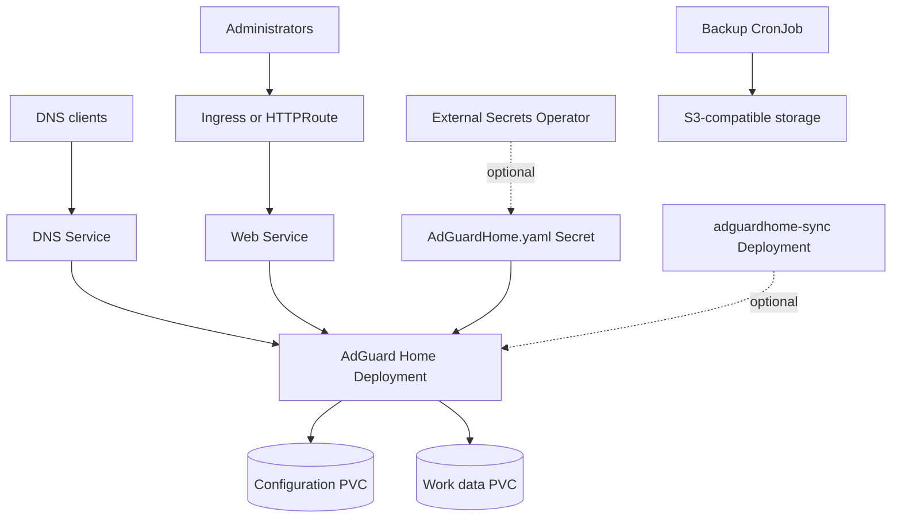

# AdGuard Home Chart Design

## Scope

This chart deploys AdGuard Home as a single-instance DNS filtering service with
an optional web setup wizard, pre-seeded configuration, synchronization helper,
Gateway API or Ingress routing, External Secrets integration, and S3 backup.

The chart is intended for home labs, small networks, and production Kubernetes
clusters that want DNS-level ad and tracker blocking with explicit persistence
and operational controls.

## Architecture

## Main Design Choices

- Keep the default in setup-wizard mode so first-time users can deploy without
  writing an `AdGuardHome.yaml` file.
- Use `config.adGuardHome` or `config.existingSecret` to bypass the wizard and
  seed a managed configuration for repeatable deployments.
- Keep the workload single-replica with `Recreate` strategy because AdGuard Home
  stores mutable DNS configuration and runtime data on local volumes.
- Expose web and DNS services separately so users can route the admin UI
  independently from DNS traffic.
- Support optional `adguardhome-sync` for users who run multiple AdGuard Home
  instances outside the scope of this chart's primary pod.
- Render ExternalSecret resources only when explicitly enabled; the chart does
  not install External Secrets Operator or manage provider-side stores.
- Keep S3 backup opt-in and use the HelmForge `mc` utility image for uploads.

## Production Boundary

Production users should set explicit values for:

- `config.adGuardHome` or `config.existingSecret`
- `service.dns.type` and any external load balancer address
- `persistence.conf.size`, `persistence.work.size`, and storage classes
- `resources`
- `ingress` or `gateway` routing for the admin UI
- backup S3 credentials via existing Kubernetes Secrets or External Secrets
- network policy and egress rules suitable for upstream DNS providers

## Non-Goals

- Installing or configuring External Secrets Operator
- Managing DNS provider or router configuration outside Kubernetes
- Multi-replica AdGuard Home from one Stateful workload
- Automatic filter list curation beyond what AdGuard Home itself manages
- Provisioning S3 buckets or cloud load balancers

<!-- @AI-METADATA
type: design
title: AdGuard Home Chart Design
description: Design document for the AdGuard Home Helm chart

keywords: adguard-home, dns, design, gateway-api, external-secrets, backup

purpose: Document architecture, chart boundaries, and production choices for AdGuard Home
scope: Chart Design

relations:
  - charts/adguard-home/README.md
  - charts/adguard-home/docs/sync.md
  - charts/adguard-home/docs/backup.md
path: charts/adguard-home/DESIGN.md
version: 1.0
date: 2026-06-09
-->
