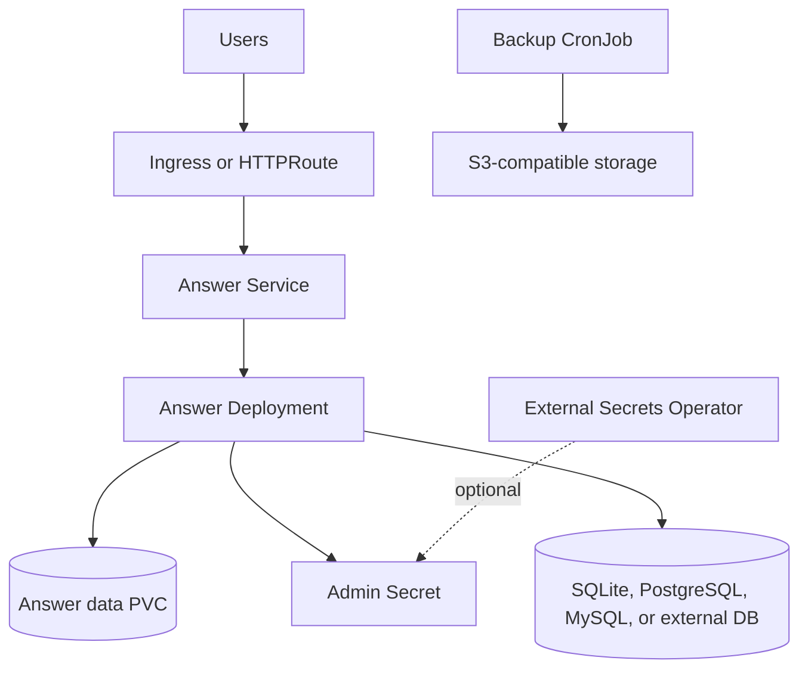

# Apache Answer Chart Design

## Scope

This chart deploys Apache Answer for team and community Q&A workloads.

Supported database modes:

- `sqlite`: default, single-pod friendly setup backed by the Answer data PVC
- `postgresql`: HelmForge PostgreSQL subchart
- `mysql`: HelmForge MySQL subchart
- `external`: existing PostgreSQL or MySQL service

The chart keeps defaults lightweight for evaluation while exposing production controls for persistence, routing, secrets, backups, and scheduling.

## Architecture

## Main Design Choices

- Keep SQLite as the zero-configuration default for trials and small internal deployments.
- Use HelmForge PostgreSQL and MySQL subcharts when users want bundled relational storage.
- Use external database mode for production platforms that already operate database services.
- Generate admin and database secrets when values do not point to existing secrets.
- Render ExternalSecret resources only when explicitly requested; the chart does not install External Secrets Operator or own provider-side secret stores.
- Support both Ingress and Gateway API HTTPRoute without enabling either by default.
- Support service dual-stack through optional `service.ipFamilyPolicy` and `service.ipFamilies`.
- Keep backup as an opt-in CronJob using database-aware dump scripts and the HelmForge `mc` utility image.

## Production Boundary

Production users should set explicit values for:

- `admin.existingSecret` or `admin.password`
- `database.mode` with PostgreSQL, MySQL, or external database for higher concurrency
- `persistence.size` and storage class
- `answer.siteUrl`
- `resources`
- routing through Ingress or Gateway API
- backup S3 credentials using existing Kubernetes Secrets or External Secrets

## Non-Goals

- Installing or configuring External Secrets Operator
- Managing external database lifecycle
- Multi-replica Answer deployment without a validated upstream horizontal scaling model
- Database major-version migration automation
- S3 provider provisioning

<!-- @AI-METADATA
type: design
title: Apache Answer Chart Design
description: Design document for the Apache Answer Helm chart

keywords: apache-answer, design, q-and-a, sqlite, postgresql, mysql, gateway-api, external-secrets

purpose: Document architecture, chart boundaries, and production choices for Apache Answer
scope: Chart Design

relations:
  - charts/answer/README.md
  - charts/answer/docs/database.md
  - charts/answer/docs/backup.md
path: charts/answer/DESIGN.md
version: 1.0
date: 2026-06-02
-->
