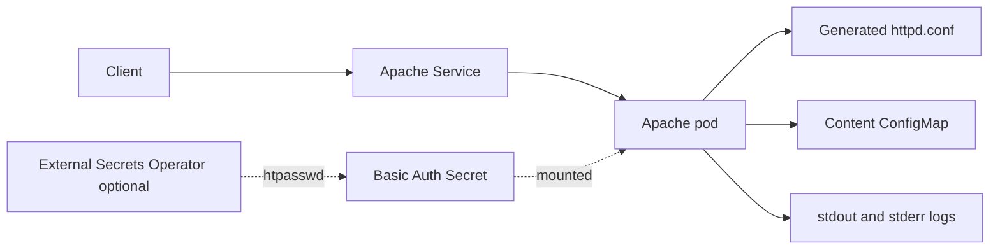

# Apache Chart Design

## Scope

This chart deploys the official Apache HTTP Server image for static sites,
simple reverse proxy configuration, and internal web endpoints that need a
small, hardened web server.

The chart intentionally focuses on Apache itself. It does not bundle a content
build system, a certificate manager, an ingress controller, or a monitoring
stack.

## Architecture

Optional integrations:

- Ingress for classic controller-based HTTP routing
- Gateway API HTTPRoute for Gateway-based platforms
- NetworkPolicy for explicit traffic boundaries
- Basic Auth from an existing Secret or ExternalSecret
- Apache exporter sidecar and ServiceMonitor

## Main Design Choices

- Use the official `httpd` image.
- Run Apache on port `8080` as a non-root user.
- Keep the root filesystem read-only and write logs to stdout/stderr.
- Generate a hardened baseline `httpd.conf` from structured values.
- Keep static content in a generated or user-managed ConfigMap.
- Support Gateway API and Ingress through separate, non-overlapping values.
- Support dual-stack Service fields on the primary Service.
- Render External Secrets Operator resources only when explicitly enabled.

## Security Boundary

Defaults are suitable for internal test and platform-owned static content. For
production, operators should provide explicit content management, network
boundaries, TLS at the ingress or Gateway layer, resource sizing, and optional
Basic Auth or upstream authentication.

## Explicit Non-Goals

- building application assets
- managing TLS certificates
- installing an ingress controller or Gateway implementation
- dynamic application runtimes such as PHP-FPM
- content synchronization from Git or object storage
- full web application firewall behavior

<!-- @AI-METADATA
type: design
title: Apache Chart Design
description: Design document for the Apache HTTP Server Helm chart
keywords: apache, httpd, design, static-site, gateway-api, ingress
purpose: Document chart architecture, decisions, and production boundaries
scope: Chart Design
relations:
  - charts/apache/README.md
  - charts/apache/docs/production.md
  - charts/apache/docs/networking.md
path: charts/apache/DESIGN.md
version: 1.0
date: 2026-05-29
-->
