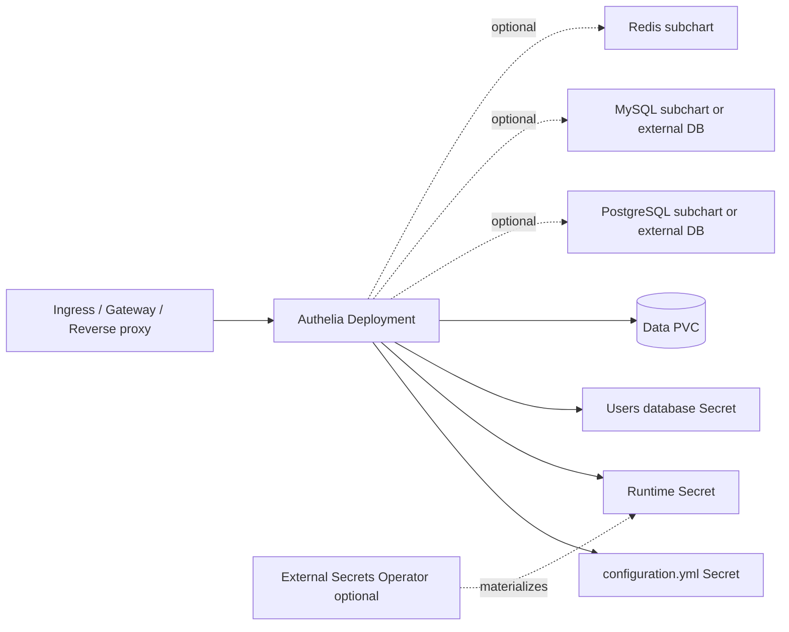

<!-- SPDX-License-Identifier: Apache-2.0 -->

# Authelia Chart Design

## Scope

This chart deploys Authelia as a Kubernetes authentication and authorization gateway for forward-auth, MFA, and OpenID Connect use cases.

Supported storage modes:

- `sqlite`: lightweight single-pod deployments backed by the `/data` PVC
- `postgres`: production storage through the HelmForge PostgreSQL subchart or an external PostgreSQL service
- `mysql`: production storage alternative through the HelmForge MySQL subchart or an external MySQL-compatible service

Redis session storage is optional and is recommended for distributed or production session workflows.

## Architecture

The chart intentionally keeps Authelia as one application pod by default. Storage, Redis, reverse proxy policy, and OIDC client definitions are explicit operator choices.

## Design Choices

- Use the official `authelia/authelia` image.
- Render Authelia configuration into a Kubernetes Secret because the configuration may contain sensitive nested values in real installations.
- Keep primary runtime credentials separate from the rendered configuration and inject them through Authelia `*_FILE` environment variables.
- Use HelmForge PostgreSQL, MySQL, and Redis subcharts instead of external third-party chart dependencies.
- Keep SQLite as the default for a simple first install, but document PostgreSQL plus Redis as the production-oriented profile.
- Render External Secrets Operator resources only when requested. The chart does not install ESO or create provider-side stores.
- Support Ingress and Gateway API as separate routing options with one `gateway` values block.
- Keep backup optional and focused on Authelia data/database export plus S3-compatible upload.

## Runtime Profiles

### SQLite

SQLite mode is suitable for local validation, homelab installs, and small single-pod environments. The `/data` PVC is the state boundary.

### PostgreSQL + Redis

PostgreSQL plus Redis is the recommended production profile. PostgreSQL stores Authelia state, while Redis externalizes session data for operational resilience.

### MySQL

MySQL is supported for users standardized on MySQL-compatible database platforms. The chart can deploy the HelmForge MySQL subchart or connect to an external database.

## Non-Goals

- Installing or configuring a reverse proxy controller.
- Managing upstream identity providers or LDAP servers.
- Creating OIDC client secrets for downstream applications.
- Installing External Secrets Operator.
- Automating database migrations outside Authelia startup behavior.
- Implementing automated HA/failover for optional database subcharts.

## Production Boundary

Production deployments should provide explicit values for:

- `secrets.existingSecret` or stable secret values
- `config.session.cookies`
- authentication backend users or LDAP
- SMTP notifier configuration
- PostgreSQL/MySQL storage or validated SQLite backup strategy
- Redis session storage when multiple replicas or stateless sessions are required
- ingress or Gateway API TLS and trusted proxy settings
- backup, monitoring, resources, and scheduling constraints

<!-- @AI-METADATA
type: design
title: Authelia Chart Design
description: Design document for the Authelia Helm chart with storage, session, routing, and production boundaries

keywords: authelia, design, authentication, forward-auth, oidc, redis, postgres, mysql, helm, kubernetes

purpose: Document chart architecture, supported runtime profiles, design choices, non-goals, and production boundaries
scope: Chart Design

relations:
  - charts/authelia/README.md
  - charts/authelia/docs/architecture.md
path: charts/authelia/DESIGN.md
version: 1.0
date: 2026-06-02
-->
