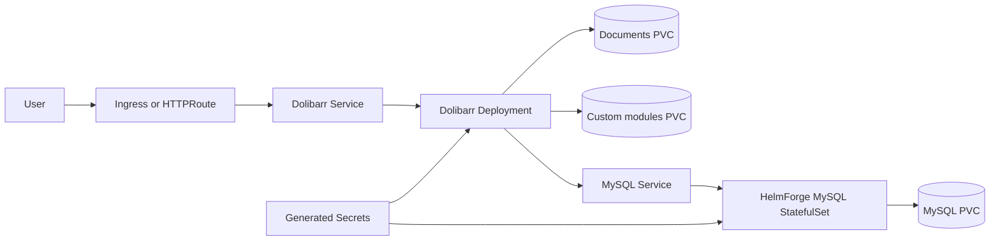
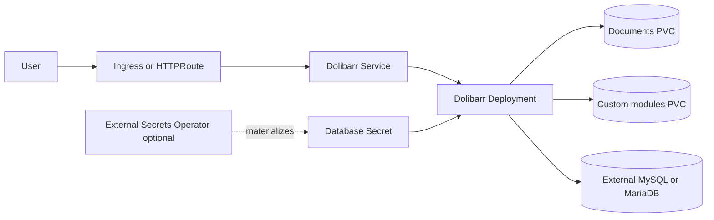

# Dolibarr Chart Design

## Scope

This chart deploys Dolibarr ERP/CRM on Kubernetes using the official `dolibarr/dolibarr` image and the HelmForge MySQL subchart by default.

Supported database modes:

- `mysql`: bundled HelmForge MySQL dependency for a self-contained release
- `external`: externally managed MySQL or MariaDB endpoint
- `auto`: select the bundled dependency unless an external database is configured

The chart intentionally targets the official container's unattended MySQL/MariaDB workflow.
PostgreSQL is not enabled as a default chart path because the official image does not
expose the same non-interactive setup contract for this chart's Kubernetes automation.

## Architecture: Bundled MySQL

This mode is appropriate for development, internal tools, and small deployments where the application and database lifecycle can be managed together.

## Architecture: External Database

External database mode is recommended when operators already provide backup, restore, replication, failover, and patching through a managed database platform.

## Operational Design

- `initContainers.wait-for-db` blocks application startup until TCP connectivity to the selected database is available.
- The default startup probe delay accounts for the official container's first-run database import before Apache starts accepting traffic.
- The bundled MySQL startup probe is delayed slightly from the subchart default to avoid false-positive probe warnings during first-run database initialization.
- Generated admin, database, and runtime secrets are preserved across upgrades with Helm `lookup`.
- Documents and custom modules use separate PVCs so generated files and locally installed modules can be sized and restored independently.
- `DOLI_CRON` is disabled by default. Scheduled jobs should be modeled explicitly once their runtime behavior is validated for Kubernetes.
- Gateway API and Ingress are both opt-in and use the chart's single HTTP service backend.
- Backup is opt-in and uses `mysqldump` plus the HelmForge `mc` image to upload compressed dumps to S3-compatible storage.

## Production Boundary

For production, operators should provide explicit values for:

- admin and database credentials through existing Secrets or External Secrets
- persistent storage classes and sizes
- resource requests and limits
- ingress or Gateway API TLS
- backup destination and retention policy
- database lifecycle ownership
- network boundaries outside this chart when required by the cluster baseline

## Explicit Non-Goals

- automated major Dolibarr upgrades or database migrations beyond the official image entrypoint behavior
- PostgreSQL automation
- bundled high availability database topology
- application cron orchestration before a stable Kubernetes validation path exists
- installing Dolibarr marketplace modules automatically

<!-- @AI-METADATA
type: design
title: Dolibarr Chart Design
description: Design document for the Dolibarr Helm chart with database modes, persistence, ingress, Gateway API, and backup boundaries

keywords: dolibarr, design, architecture, mysql, mariadb, gateway-api, backup, helm, kubernetes

purpose: Document Dolibarr chart architecture, operational choices, production boundaries, and non-goals
scope: Chart Design

relations:
  - charts/dolibarr/README.md
  - charts/dolibarr/docs/database.md
path: charts/dolibarr/DESIGN.md
version: 1.0
date: 2026-06-02
-->
