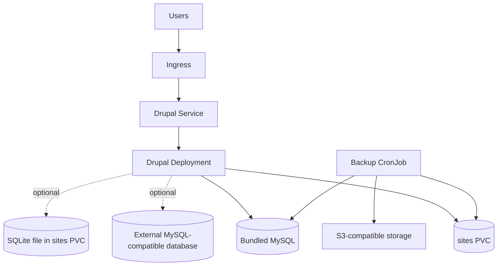

# Drupal Chart Design

## Scope

This chart deploys Drupal with an Apache PHP runtime, installer-aware database
configuration, persistence for `sites/`, optional ingress, optional autoscaling
guardrails, and scheduled S3-compatible backups.

The chart targets teams that want a production-oriented Drupal deployment with
explicit image pinning, predictable persistence, and database paths that match
Drupal's web installer.

## Architecture

## Main Design Choices

- Pin the Docker Official Drupal Apache image to the Drupal, PHP, and Debian
  release tuple instead of using a floating tag.
- Persist only `/var/www/html/sites` so installed site state, uploads, and
  SQLite data survive restarts without masking Drupal core files from the image.
- Keep MySQL enabled by default for a guided first install while also supporting
  external MySQL-compatible databases and SQLite for single-replica use.
- Keep one replica by default and require compatible storage/database choices
  before autoscaling or multi-replica operation.
- Keep backup automation opt-in and focused on the mutable `sites/` directory
  plus the selected database backend.

## Production Boundary

Production users should set explicit values for:

- `ingress.hosts` and TLS configuration
- `persistence.size`, `persistence.storageClass`, and ReadWriteMany storage when
  running multiple replicas
- `database.mode` and external database credentials when not using the bundled
  MySQL subchart
- `resources`
- `autoscaling` and `pdb` only after storage and database choices are compatible
- `backup.s3` credentials and retention policy

## Non-Goals

- Running Drupal's web installer automatically
- Managing Drupal modules, themes, or configuration synchronization
- Provisioning external databases, object stores, or cloud load balancers
- Supporting multi-replica SQLite deployments

<!-- @AI-METADATA
type: design
title: Drupal Chart Design
description: Design document for the Drupal Helm chart

keywords: drupal, cms, apache, php, mysql, sqlite, backup, design

purpose: Document architecture, chart boundaries, and production choices for Drupal
scope: Chart Design

relations:
  - charts/drupal/README.md
  - charts/drupal/docs/database.md
  - charts/drupal/docs/backup.md
  - charts/drupal/docs/persistence.md
  - charts/drupal/docs/scaling.md
path: charts/drupal/DESIGN.md
version: 1.0
date: 2026-06-09
-->
