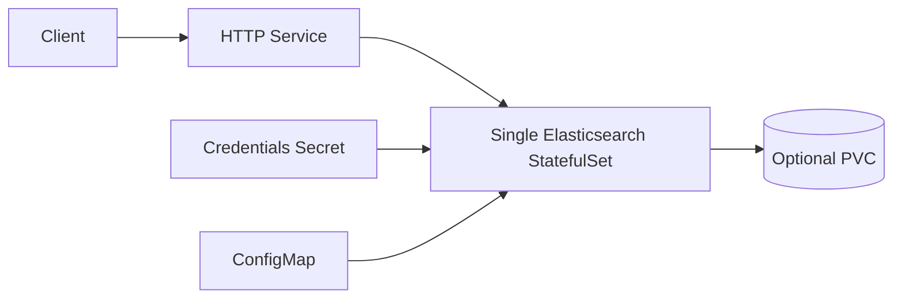
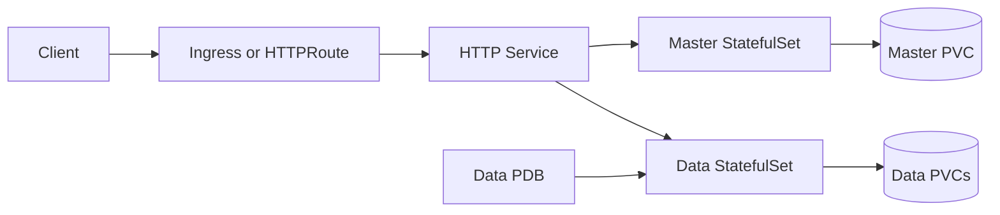
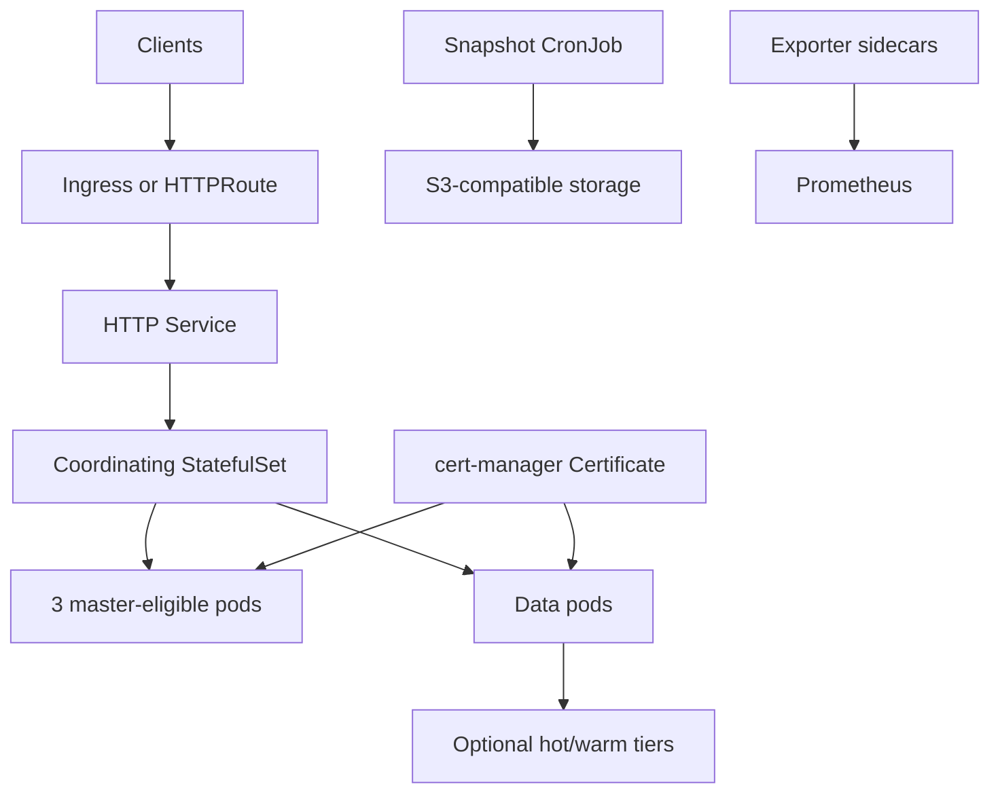

# Elasticsearch Chart Design

## Scope

This chart deploys Elasticsearch using the official `docker.io/library/elasticsearch` image.
It is built around profile-driven Kubernetes topologies instead of requiring users to assemble every role manually.

Supported profiles:

- `dev`: single-node development profile with lightweight defaults
- `staging`: representative multi-node profile for validation and integration environments
- `production-ha`: multi-role high availability profile with master, data, and coordinating nodes

Optional capabilities include S3 snapshots, ILM policies, hot/warm data tiers, cert-manager TLS, External Secrets,
Gateway API, Prometheus monitoring, Grafana dashboards, and a colocated Kibana deployment.

## Architecture: Dev

The dev profile keeps the deployment small for local clusters and chart validation. It is not intended for production data.

## Architecture: Staging

The staging profile validates shard placement, persistence, PDB behavior, and operational settings without the full
resource footprint of production HA.

## Architecture: Production HA

Production HA separates roles, enables disruption budgets, and provides opt-in TLS, backups, monitoring, and tiered storage.
Operators should still own capacity planning, shard strategy, snapshots, restore drills, and version upgrade sequencing.

## Main Design Choices

- Use the official Elasticsearch and Kibana images.
- Keep chart defaults lightweight while exposing production profiles through `clusterProfile`.
- Generate role-specific StatefulSets instead of using a single generic pod template.
- Keep Kibana optional and version-aligned with Elasticsearch.
- Render Gateway API and External Secrets only when explicitly enabled.
- Use cert-manager integration when TLS is managed by the cluster, and self-signed hook jobs for clusters without it.
- Provide S3 snapshots as an explicit scheduled backup path, not as a replacement for restore testing.

## Production Boundary

Before production use, operators should define:

- credentials through existing Secrets or External Secrets
- TLS issuer and certificate lifecycle
- PVC sizes and storage classes per role or tier
- resource requests, JVM heap, and shard allocation strategy
- backup bucket, retention, and restore runbooks
- monitoring, alert routing, and dashboard ownership
- upgrade sequencing for Elasticsearch, Kibana, plugins, index templates, and ILM policies

## Explicit Non-Goals

- Elasticsearch operator behavior
- automatic major version migrations
- automatic shard rebalancing policy decisions beyond Elasticsearch defaults
- plugin installation and lifecycle management
- cross-cluster replication or remote cluster orchestration
- replacing Elastic Cloud Enterprise, ECK, or managed Elasticsearch platforms

<!-- @AI-METADATA
type: design
title: Elasticsearch Chart Design
description: Design document for the Elasticsearch Helm chart profiles, architecture, production boundary, and non-goals

keywords: elasticsearch, design, architecture, profiles, production-ha, staging, data-tiers, backup, kubernetes

purpose: Document chart architecture, supported profiles, operational decisions, and production boundaries
scope: Chart Design

relations:
  - charts/elasticsearch/README.md
  - charts/elasticsearch/docs/profile-dev.md
  - charts/elasticsearch/docs/profile-staging.md
  - charts/elasticsearch/docs/profile-production-ha.md
  - charts/elasticsearch/docs/backup-restore.md
  - charts/elasticsearch/docs/security.md
path: charts/elasticsearch/DESIGN.md
version: 1.0
date: 2026-06-02
-->
