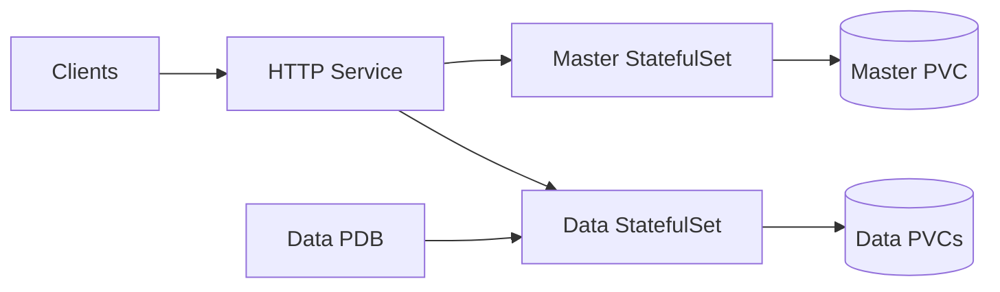

# Elasticsearch Staging Profile

## Scope

The `staging` profile is a representative multi-node Elasticsearch topology for integration environments, release
validation, and pre-production operational checks.

It is designed to validate behavior that the `dev` profile cannot cover:

- master and data role separation
- persistent data nodes
- data PodDisruptionBudget rendering
- service discovery and cluster formation with more than one pod
- ingress, Gateway API, monitoring, backup, and security combinations before production

## Recommended Use

```yaml
clusterProfile: staging

master:
  persistence:
    size: 20Gi

data:
  persistence:
    size: 100Gi

security:
  enabled: true
```

Use staging before production upgrades to verify:

- snapshot and restore workflow
- Kibana version compatibility
- plugins and custom index templates
- ILM policy behavior
- Prometheus scraping and alert rules
- Gateway API or Ingress routing

## Architecture



## Production Differences

Compared with `production-ha`, staging intentionally keeps the footprint smaller:

- one master pod instead of three master-eligible pods
- two data pods instead of the production data default
- no coordinating nodes by default
- smaller profile-driven resource and storage defaults
- only data PDB enabled by default

Do not treat the staging profile as highly available production Elasticsearch. It is a validation profile.

## Operational Notes

- Keep staging on the same minor version as production when testing upgrades.
- Use a separate snapshot repository or bucket prefix from production.
- Use production-like index templates and ILM policies when validating behavior.
- Use explicit PVC sizes and storage classes so test results reflect the target platform.

<!-- @AI-METADATA
type: chart-doc
title: Elasticsearch Staging Profile
description: Operational guide for the Elasticsearch staging profile

keywords: elasticsearch, staging, profile, validation, helm, kubernetes

purpose: Explain when and how to use the staging profile and how it differs from production HA
scope: Chart Documentation

relations:
  - charts/elasticsearch/README.md
  - charts/elasticsearch/DESIGN.md
  - charts/elasticsearch/docs/profile-dev.md
  - charts/elasticsearch/docs/profile-production-ha.md
path: charts/elasticsearch/docs/profile-staging.md
version: 1.0
date: 2026-06-02
-->
