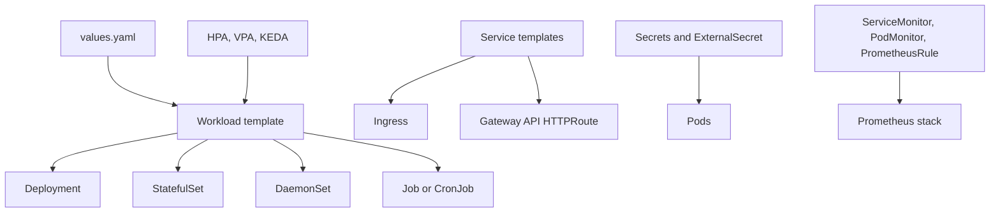

# Generic Chart Design

## Scope

This chart provides a reusable Kubernetes workload wrapper for teams that need one operational values contract across many simple services.

Supported workload modes:

- `Deployment` for stateless services, APIs, workers, and web applications
- `StatefulSet` for workloads that need stable pod identity or per-replica claim templates
- `DaemonSet` for node-level agents
- `Job` and `CronJob` for batch-oriented releases

The chart intentionally models Kubernetes primitives directly. It is a platform building block, not an application-specific chart.

## Architecture

## Main Design Choices

- Keep the default path small: one `Deployment`, one `Service`, and a pinned nginx image.
- Treat the first container as the default probe target while allowing per-container overrides.
- Render one primary Service by default and support additional Services through `services[]`.
- Keep CRD-backed integrations opt-in. ExternalSecret, SealedSecret, ServiceMonitor, PodMonitor, PrometheusRule, KEDA,
  VPA, and Gateway API resources require their operators or CRDs to exist before users enable them.
- Render ExternalSecret resources with `external-secrets.io/v1`, matching the current External Secrets Operator API.
- Validate unsafe combinations at render time, including HPA with DaemonSet, incomplete PDB configuration, and routes that would point to a disabled primary Service.
- Avoid time-based pod annotations. Intentional rollouts use `rollout.restartAt` or checksum-driven ConfigMap and Secret changes.

## Production Boundary

Production users should set explicit values for:

- `image.repository`, `image.tag`, and `image.pullPolicy`
- container ports, probes, env, envFrom, and resource requests/limits
- `service`, Ingress, or Gateway API exposure
- `securityPreset`, `podSecurityContext`, and `securityContext`
- `pdb`, `hpa`, `topologySpreadConstraints`, and scheduling controls where appropriate
- Secret source through `secrets[]`, `externalSecrets.items[]`, or existing Kubernetes Secrets
- observability resources only when the corresponding CRDs are installed

## Non-Goals

- Modeling application-specific domain concepts
- Installing platform operators such as External Secrets Operator, Prometheus Operator, KEDA, or Gateway API controllers
- Replacing purpose-built charts for databases, brokers, or applications with complex bootstrap logic
- Managing cloud resources, DNS providers, certificate issuers, or provider-side secret stores
- Providing universal production defaults for every workload type

<!-- @AI-METADATA
type: design
title: Generic Chart Design
description: Design document for the generic multi-workload Helm chart

keywords: generic, design, deployment, statefulset, daemonset, batch, external-secrets

purpose: Document architecture, chart boundaries, and production choices for the generic Helm chart
scope: Chart Design

relations:
  - charts/generic/README.md
  - charts/generic/docs/deployment.md
  - charts/generic/docs/security.md
  - charts/generic/docs/observability.md
path: charts/generic/DESIGN.md
version: 1.0
date: 2026-06-09
-->
