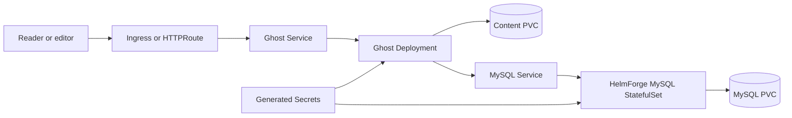
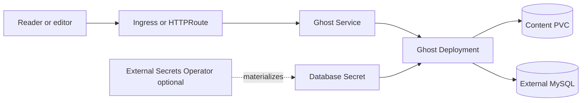

# Ghost Chart Design

## Scope

This chart deploys Ghost using the official `docker.io/library/ghost` image and a MySQL-compatible database.
It focuses on a single Ghost instance because Ghost content storage, themes, uploads, and runtime behavior are not
designed for horizontal scaling without additional shared storage and application-level planning.

Supported database modes:

- bundled HelmForge MySQL subchart
- external MySQL-compatible database

Supported edge options:

- ClusterIP service with port-forward access
- Kubernetes Ingress
- Gateway API HTTPRoute

## Architecture: Bundled MySQL

This mode is appropriate for small sites, development, and self-contained deployments where the database lifecycle is
managed with the Ghost release.

## Architecture: External Database

External database mode is recommended when the platform already provides backup, restore, replication, patching, and
failover for MySQL.

## Main Design Choices

- Use the official Ghost image.
- Use the HelmForge MySQL subchart by default.
- Keep the bundled MySQL image on MySQL 8 because Ghost production support is
  tied to MySQL 8 even when the HelmForge MySQL dependency supports newer
  MySQL majors.
- Keep Ghost single-instance by default.
- Persist `/var/lib/ghost/content` because it contains themes, images, media, and uploaded files.
- Keep database credentials in Secrets and allow External Secrets for platform-managed credentials.
- Provide S3-compatible content backups through an optional CronJob.
- Render Ingress and Gateway API only when explicitly enabled.

## Production Boundary

For production, operators should define:

- `ghost.url` with the public canonical URL
- explicit database credentials or an existing database Secret
- PVC size, storage class, and backup retention
- ingress or Gateway API TLS settings
- mail settings through `ghost.extraEnv`
- content backup and database backup runbooks
- staging validation for themes, custom integrations, newsletters, comments, and member signup flows

## Explicit Non-Goals

- horizontal scaling by default
- managed database failover
- Ghost theme installation automation
- newsletter provider provisioning
- Stripe or payment provider configuration
- automatic major-version migration beyond the official Ghost entrypoint behavior

<!-- @AI-METADATA
type: design
title: Ghost Chart Design
description: Design document for the Ghost Helm chart with database modes, persistence, edge routing, and production boundaries

keywords: ghost, design, architecture, mysql, cms, publishing, backup, gateway-api, kubernetes

purpose: Document chart architecture, operational decisions, production boundaries, and non-goals
scope: Chart Design

relations:
  - charts/ghost/README.md
  - charts/ghost/docs/database.md
path: charts/ghost/DESIGN.md
version: 1.0
date: 2026-06-02
-->
