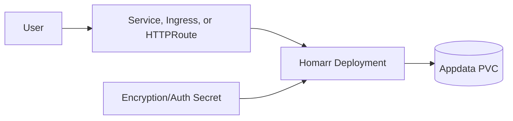
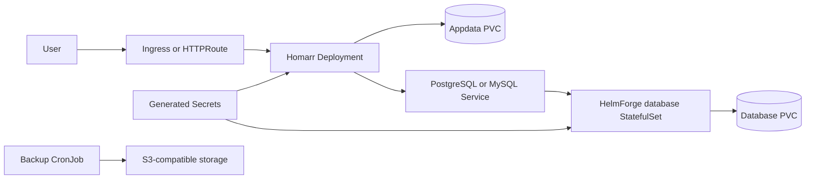
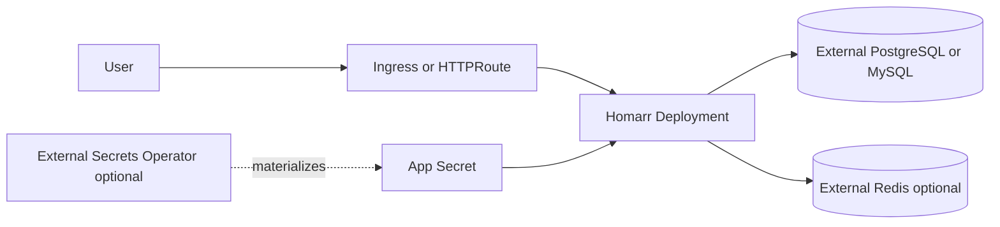

# Homarr Chart Design

## Scope

This chart deploys Homarr using the official `ghcr.io/homarr-labs/homarr` image.
It supports local dashboard deployments as well as database-backed environments with Kubernetes integration and backups.

Supported database modes:

- SQLite, the default zero-dependency mode
- bundled HelmForge PostgreSQL subchart
- bundled HelmForge MySQL subchart
- external PostgreSQL or MySQL

Optional capabilities include Kubernetes workload discovery, external Redis, S3-compatible backups, External Secrets,
Ingress, Gateway API, and dual-stack Services.

## Architecture: SQLite

SQLite mode is suitable for local dashboards, small self-hosted installations, and simple environments where one Homarr
replica owns the `/appdata` volume.

## Architecture: Bundled Database

Bundled database mode is useful when the application and database lifecycle should be managed together by the release.

## Architecture: External Services

External database and Redis are recommended for platforms that already manage persistence, patching, backup, restore, and
failover outside the application chart.

## Main Design Choices

- Use HelmForge PostgreSQL and MySQL dependencies when database subcharts are enabled.
- Keep SQLite as the default for simple deployments.
- Keep database mode selection explicit and validate ambiguous combinations.
- Use discrete database environment variables instead of a full `DB_URL` so passwords do not need URL encoding.
- Disable Homarr's internal DNS cache by default so Kubernetes Service resolution stays current during database startup.
- Preserve generated encryption/auth secrets across upgrades.
- Include a PostgreSQL upgrade hook that reapplies Homarr database grants for existing bundled PostgreSQL installations.
- Render Gateway API and External Secrets only when explicitly enabled.
- Keep default security hardening compatible with the official image: resource limits, no privilege escalation, and
  `RuntimeDefault` seccomp are enabled, while writable root filesystem, root UID, and default capabilities remain because
  nginx writes `/etc/nginx/nginx.conf` and `/var/lib/nginx` at startup.

## Production Boundary

For production, operators should define:

- database mode and credentials
- PVC sizes and storage classes
- `SECRET_ENCRYPTION_KEY` through an existing Secret or External Secret
- ingress or Gateway API TLS settings
- backup schedule, destination, retention, and restore runbooks
- Kubernetes RBAC boundaries when workload discovery is enabled
- external Redis only when the target architecture requires it

## Explicit Non-Goals

- database failover orchestration
- Redis deployment as a bundled subchart
- application-level HA guarantees for SQLite mode
- automatic migration between database engines
- managing external SecretStores or Gateway controllers

<!-- @AI-METADATA
type: design
title: Homarr Chart Design
description: Design document for the Homarr Helm chart database modes, architecture, backups, and production boundaries

keywords: homarr, design, architecture, sqlite, postgresql, mysql, backup, gateway-api, kubernetes

purpose: Document chart architecture, database modes, operational choices, production boundaries, and non-goals
scope: Chart Design

relations:
  - charts/homarr/README.md
  - charts/homarr/docs/database.md
path: charts/homarr/DESIGN.md
version: 1.0
date: 2026-06-02
-->
