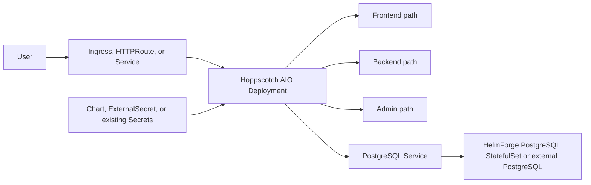

# Hoppscotch Chart Design

## Scope

This chart deploys Hoppscotch Community Edition using the official AIO image. It is designed for self-hosted API
workspaces that need a single Kubernetes workload with frontend, backend, admin dashboard, PostgreSQL, authentication,
SMTP, and edge routing managed consistently.

Supported deployment modes:

- development mode with bundled HelmForge PostgreSQL enabled by default
- production mode with bundled or external PostgreSQL
- optional OAuth, SMTP, External Secrets, Gateway API, NetworkPolicy, and ServiceMonitor integrations

## Architecture

The chart enables subpath based access so one service and one hostname can expose the web app, backend APIs, WebSocket
endpoint, and admin dashboard.

## Main Design Choices

- Use the official `docker.io/hoppscotch/hoppscotch` AIO image to keep the chart operationally simple.
- Use the HelmForge PostgreSQL subchart for bundled persistence.
- Run Prisma migrations in an init container before the application starts.
- Bootstrap `pg_trgm` on fresh bundled PostgreSQL databases and keep a pre-upgrade hook for existing PVCs.
- Persist `DATA_ENCRYPTION_KEY` and `WEBAPP_SERVER_SIGNING_KEY` through Kubernetes Secrets.
- Use the HelmForge-standard `ingress.ingressClassName` field for Ingress class selection.
- Expose `proxy.appUrl` as an optional `PROXY_APP_URL` bootstrap value for self-hosted proxy defaults.

## Production Boundary

For production, operators should define:

- stable `DATA_ENCRYPTION_KEY` and `WEBAPP_SERVER_SIGNING_KEY` through existing Secrets or External Secrets
- PostgreSQL storage class, size, backup, restore, and retention policy
- hostname, TLS, and WebSocket-capable ingress or Gateway API configuration
- OAuth provider credentials and callback URLs
- SMTP settings for magic links and invitations
- resource requests, limits, PDB, and NetworkPolicy settings

## Explicit Non-Goals

- deploying Hoppscotch's split frontend/backend/admin image topology
- managing OAuth application registration in external identity providers
- managing PostgreSQL backups directly in this chart
- provisioning ingress controllers, Gateway controllers, or SecretStores

<!-- @AI-METADATA
type: design
title: Hoppscotch Chart Design
description: Design document for the Hoppscotch Helm chart architecture, database model, routing, and production boundaries

keywords: hoppscotch, design, architecture, postgresql, ingress, gateway-api, oauth, smtp, helm, kubernetes

purpose: Document chart architecture, operational choices, production boundaries, and non-goals
scope: Chart Design

relations:
  - charts/hoppscotch/README.md
  - charts/hoppscotch/docs/database.md
  - charts/hoppscotch/docs/authentication.md
  - charts/hoppscotch/docs/production.md
path: charts/hoppscotch/DESIGN.md
version: 1.0
date: 2026-06-02
-->
