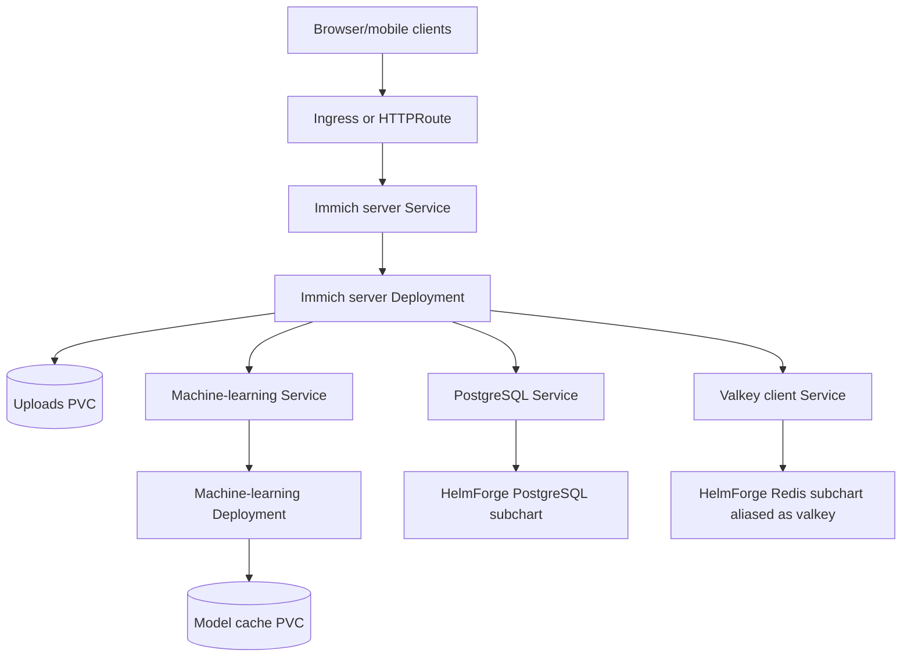

# Immich Chart Design

## Scope

This chart deploys Immich server, Immich machine learning, PostgreSQL, and a
Redis-compatible cache using Helm-native resources and HelmForge subcharts.

Supported dependency modes:

- bundled HelmForge PostgreSQL subchart with the Immich VectorChord image
- bundled HelmForge Redis subchart aliased as `valkey`
- external PostgreSQL and external Redis/Valkey-compatible cache
- optional External Secrets Operator resources for externally owned credentials

## Architecture: Bundled Dependencies

## Main Design Choices

- Use official Immich images for server and machine-learning workloads.
- Use the HelmForge PostgreSQL chart, overriding the image to Immich's
  VectorChord PostgreSQL build.
- Use the HelmForge Redis chart aliased as `valkey` because Immich consumes the
  Redis protocol and the existing HelmForge chart is the shared cache primitive.
- Keep upload persistence separate from database/cache persistence.
- Fail render-time validation when server replicas or autoscaling use upload
  persistence without `ReadWriteMany`.
- Use `Recreate` automatically when upload persistence is enabled without
  `ReadWriteMany`, avoiding RollingUpdate surge contention on a single RWO PVC.
- Use a single `gateway` values block for Gateway API HTTPRoute support.

## Explicit Non-Goals

- object storage provisioning
- automated Immich backup jobs
- database major-version migrations
- installing Ingress controllers, Gateway API CRDs, or External Secrets Operator
- replacing Immich's application-level migration flow

## Production Boundary

Production deployments should provide explicit values for:

- upload storage class and size
- PostgreSQL and cache credentials through Secrets or External Secrets
- durable PostgreSQL and cache storage
- Ingress or Gateway API TLS
- resources and topology constraints
- backup and restore runbooks outside this chart

<!-- @AI-METADATA
type: design
title: Immich Chart Design
description: Design document for the Immich Helm chart architecture and dependency modes
keywords: immich, design, postgresql, redis, valkey, machine-learning
purpose: Document chart design choices and production boundaries
scope: Chart Design
relations:
  - charts/immich/README.md
  - charts/immich/docs/production.md
path: charts/immich/DESIGN.md
version: 1.0
date: 2026-05-29
-->
