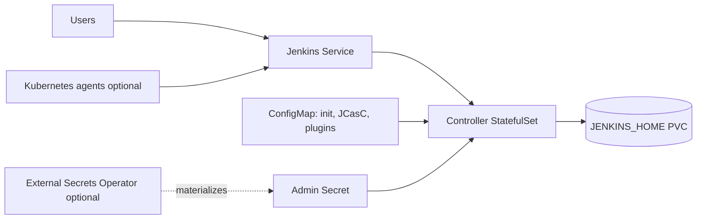

# Jenkins Chart Design

## Scope

This chart deploys a single Jenkins controller with persistent `JENKINS_HOME`,
optional Configuration as Code, optional plugin bootstrap, and Kubernetes
networking integrations.

Jenkins controller high availability is intentionally out of scope because the
standard Jenkins controller is stateful and single-writer. Production resilience
comes from persistence, backups, upgrade discipline, and externalized
configuration.

## Architecture

Optional integrations:

- Ingress and Gateway API HTTPRoute
- NetworkPolicy boundaries
- ExternalSecret for admin credentials
- ServiceMonitor for Jenkins Prometheus plugin endpoints
- RBAC for Kubernetes agent workflows

## Main Design Choices

- Use the official `jenkins/jenkins` LTS image with Java 21.
- Use a StatefulSet so the controller has stable storage identity.
- Keep replica count fixed at one.
- Support initial admin bootstrapping while allowing externally managed
  credentials.
- Keep plugin bootstrap opt-in because plugin resolution performs network I/O
  and changes startup time.
- Support JCasC as mounted ConfigMap snippets, but do not force the plugin.
- Render External Secrets Operator resources only when requested.

## Production Boundary

Production users should configure persistence, backups, explicit admin
credentials, plugin pinning, JCasC, resource sizing, network policy, and a
controlled upgrade process.

## Explicit Non-Goals

- active-active Jenkins controller HA
- bundled backup controller
- automatic plugin upgrade policy
- installing the Kubernetes plugin by default
- managing build agents outside Jenkins configuration
- installing ingress, Gateway, Prometheus, or External Secrets operators

<!-- @AI-METADATA
type: design
title: Jenkins Chart Design
description: Design document for the Jenkins Helm chart
keywords: jenkins, ci, cd, statefulset, jcasc, plugins
purpose: Document chart architecture, decisions, and production boundaries
scope: Chart Design
relations:
  - charts/jenkins/README.md
  - charts/jenkins/docs/production.md
  - charts/jenkins/docs/jcasc-and-plugins.md
path: charts/jenkins/DESIGN.md
version: 1.0
date: 2026-05-29
-->
