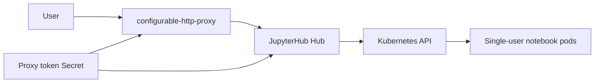

# JupyterHub Chart Design

## Goals

- Deploy JupyterHub with configurable-http-proxy and KubeSpawner using secure Kubernetes defaults.
- Keep the default install useful for local and classroom scenarios while validating unsafe public exposure.
- Support Ingress, Gateway API, dual-stack Services, NetworkPolicy, ServiceMonitor, PDB, and ExternalSecret.
- Generate or reuse the configurable-http-proxy token without storing credentials in ConfigMaps.

## Architecture

## Security Defaults

- Hub and proxy containers run as non-root with dropped Linux capabilities and runtime default seccomp.
- KubeSpawner disables automounted tokens for single-user pods.
- Public exposure with DummyAuthenticator requires either `auth.dummyPassword` or an explicit insecure opt-in.
- Public exposure with custom authenticators requires `hub.extraConfig` to set `authenticator_class`.
- Prometheus metrics remain authenticated by default, and public anonymous metrics require an explicit opt-in.
- The Hub Deployment uses `Recreate` while the default SQLite PVC is enabled.
- The proxy runs separately from the Hub, so `hub.cleanupServers=false` keeps user notebook pods running across Hub restarts.

## Persistence

The default Hub database is SQLite on the Hub PVC for a low-friction single-node
install. For larger production deployments, use `hub.extraConfig` to configure
an external JupyterHub database and manage that database with the HelmForge
PostgreSQL chart.

## Networking

Ingress uses `ingress.ingressClassName`. Gateway API uses the single standard `gateway` block and renders an `HTTPRoute` to the public proxy Service.
When the Service is dual-stack or IPv6, configurable-http-proxy binds public and
API listeners to `::`; `proxy.bind.ip` and `proxy.bind.apiIp` can override the
detected bind addresses.
