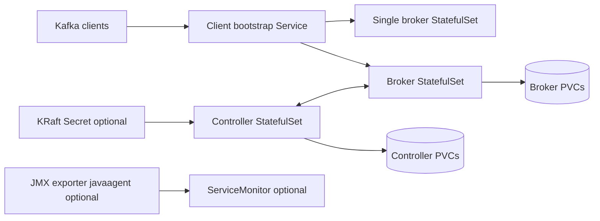

# Kafka Chart Design

## Scope

This chart deploys Apache Kafka in KRaft mode with the official `apache/kafka`
runtime image. It supports a development-oriented single-broker topology and
production-oriented cluster topologies with either dedicated controller and
broker StatefulSets or combined controller/broker pods.

The chart is intentionally Kafka-only. It does not install ZooKeeper, Kafka
Connect, MirrorMaker, Schema Registry, UIs, TLS/SASL automation, or external
listener matrices.

## Architecture

Topology selection:

- `architecture=single-broker` renders one StatefulSet that runs broker and
  controller roles together.
- `architecture=cluster` with `cluster.brokers.replicaCount > 0` renders
  dedicated controller and broker StatefulSets.
- `architecture=cluster` with `cluster.brokers.replicaCount=0` renders combined
  controller/broker pods for a 3-node HA topology with fewer pods.

## Main Design Choices

- Use KRaft only because Kafka 4.x is the supported runtime line for this chart.
- Keep the bootstrap service internal by default.
- Use StatefulSets and stable pod DNS for advertised listeners.
- Persist controller metadata and broker logs by default.
- Support an existing KRaft Secret so production deployments can keep the
  cluster ID stable across reinstall and upgrade events.
- Keep topic creation explicit by default through
  `config.autoCreateTopicsEnabled=false`.
- Support Prometheus metrics through the JMX exporter javaagent and an optional
  ServiceMonitor.
- Keep external listener, TLS, SASL, ACL, and ecosystem component lifecycle out
  of scope until each can be modeled safely.

## Production Boundary

Production users should use `architecture=cluster`, pin a stable KRaft cluster
ID in `kraft.existingSecret`, size PVCs for expected retention and partition
count, set resource requests and limits, enable PodDisruptionBudget, and test
topic creation, producer, consumer, and pod rescheduling flows before promotion.

Combined mode is supported for constrained clusters, but it couples controller
and broker capacity. Dedicated controllers and brokers remain the preferred
topology for higher-throughput production workloads.

## Current Gaps and Improvement Candidates

- Add first-class NetworkPolicy support for client, controller, broker, and
  metrics traffic.
- Add explicit resource defaults for production examples without forcing
  restrictive defaults on development installs.
- Add an offline-friendly JMX exporter option for clusters that cannot download
  the javaagent artifact from Maven Central during init.
- Add TLS/SASL and external listener designs only after the value contract can
  represent certificate, credential, DNS, and load balancer lifecycles clearly.

## Explicit Non-Goals

- ZooKeeper mode
- automatic KRaft migration from ZooKeeper-based clusters
- external listener automation
- TLS, SASL, ACL, and credential lifecycle management
- Kafka Connect, MirrorMaker, Schema Registry, REST Proxy, or Kafka UI
- installing Prometheus Operator or External Secrets Operator

<!-- @AI-METADATA
type: design
title: Kafka Chart Design
description: Design document for the Kafka Helm chart
keywords: kafka, kraft, statefulset, streaming, messaging
purpose: Document chart architecture, decisions, production boundaries, and non-goals
scope: Chart Design
relations:
  - charts/kafka/README.md
  - charts/kafka/docs/cluster.md
  - charts/kafka/docs/combined-mode.md
  - charts/kafka/docs/single-broker.md
path: charts/kafka/DESIGN.md
version: 1.0
date: 2026-06-14
-->
