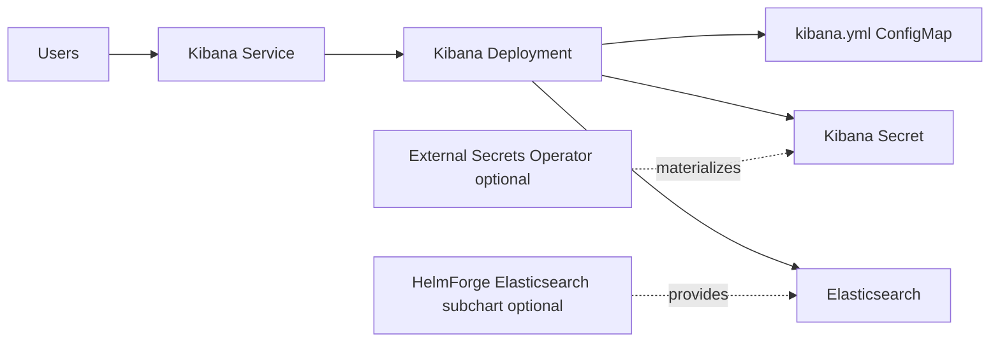

# Kibana Chart Design

## Scope

This chart deploys Kibana as the Elastic Stack UI, connected to an existing
Elasticsearch service or to an optional HelmForge Elasticsearch subchart for
local and development environments.

Kibana state is mostly stored in Elasticsearch. The chart only persists
`/usr/share/kibana/data` when operators explicitly enable persistence for local
plugins and runtime cache.

## Architecture

Optional integrations:

- HelmForge Elasticsearch subchart through `bundledElasticsearch.enabled`
- Ingress or Gateway API HTTPRoute
- NetworkPolicy for inbound and Elasticsearch egress boundaries
- ExternalSecret for service account tokens and encryption keys
- Wolfi image flavor for hardened runtime baselines
- ServiceMonitor for Prometheus-compatible metrics endpoints

## Main Design Choices

- Use Elastic's official Kibana image by default.
- Keep the Wolfi image opt-in through `image.flavor=wolfi`.
- Keep Elasticsearch connectivity explicit in `elasticsearch.hosts`.
- Use a dependency alias for bundled Elasticsearch to avoid breaking the
  existing `elasticsearch.*` connection values.
- Require stable encryption keys for multi-replica deployments.
- Render External Secrets Operator resources only when requested.
- Keep Gateway API and Ingress as separate, non-overlapping entry points.

## Production Boundary

Production deployments should connect to a managed or separately operated
Elasticsearch cluster with TLS, authentication, and static Kibana encryption
keys. The bundled Elasticsearch subchart is primarily for local validation,
development, demos, and tightly scoped platform-owned stacks.

## Explicit Non-Goals

- operating a full Elastic Stack lifecycle
- Elasticsearch data migration orchestration
- Fleet Server, APM Server, or Beats deployment
- automatic Kibana saved object migration rollback
- installing ingress, Gateway, Prometheus, or External Secrets operators

<!-- @AI-METADATA
type: design
title: Kibana Chart Design
description: Design document for the Kibana Helm chart
keywords: kibana, elasticsearch, observability, dashboard, gateway-api
purpose: Document chart architecture, decisions, and production boundaries
scope: Chart Design
relations:
  - charts/kibana/README.md
  - charts/kibana/docs/production.md
  - charts/kibana/docs/elasticsearch.md
path: charts/kibana/DESIGN.md
version: 1.0
date: 2026-05-29
-->
