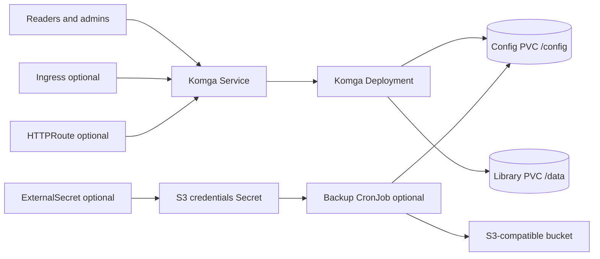

# Komga Chart Design

## Scope

This chart deploys Komga as a single-instance media server for comics, manga,
magazines, and ebooks. It uses the official `gotson/komga` image, SQLite-backed
application state on `/config`, a separate library volume on `/data`, and
optional HTTP exposure through Ingress or Gateway API.

The chart is intentionally focused on the Komga application and the Kubernetes
resources needed to run it predictably. It does not install external databases,
object storage, authentication proxies, media indexers, or backup storage
services.

## Architecture

The workload is a single Deployment with one replica because Komga stores its
application database in SQLite. The chart separates `/config` and `/data` so the
database/config volume can be backed up independently from large media files.

## Main Design Choices

- Use the official upstream `gotson/komga` image pinned to the chart appVersion.
- Keep SQLite as the default and only database mode.
- Persist both `/config` and `/data` by default.
- Keep the service internal by default, with explicit opt-in for Ingress or
  Gateway API.
- Expose JVM tuning through `komga.javaToolOptions` without forcing a memory
  profile on small installs.
- Provide an optional S3 backup CronJob for consistent SQLite exports and config
  archives.
- Support External Secrets Operator for S3 backup credentials without making ESO
  a chart dependency.

## Production Boundary

Production deployments should keep persistence enabled, size the `/data` PVC for
the media library, configure `komga.javaToolOptions` for the available memory,
set explicit resource requests and limits, and use Ingress or Gateway API only
with TLS termination handled by the cluster ingress layer.

Backups cover SQLite database files and top-level application configuration from
`/config`. They intentionally exclude library media under `/data`; media backup
or replication belongs to the storage platform or a separate backup workflow.

## Current Gaps and Improvement Candidates

- Add first-class NetworkPolicy support for web traffic and backup egress.
- Add an optional PodDisruptionBudget if the chart grows beyond a single
  replica model.
- Add hardened default security contexts after validating the upstream image
  user, writable paths, and backup containers across amd64 and arm64.
- Add documented restore smoke tests for the backup workflow.
- Add optional ServiceMonitor support if Komga exposes stable application
  metrics in a future release.

## Explicit Non-Goals

- running multiple Komga replicas against the same SQLite database
- external database automation
- bundled object storage
- bundled authentication proxy or SSO gateway
- media file backup for `/data`
- installing External Secrets Operator, Gateway API CRDs, or cert-manager

<!-- @AI-METADATA
type: design
title: Komga Chart Design
description: Design document for the Komga Helm chart
keywords: komga, comics, manga, sqlite, media-server, backup
purpose: Document chart architecture, decisions, production boundaries, and non-goals
scope: Chart Design
relations:
  - charts/komga/README.md
  - charts/komga/docs/backup.md
  - charts/komga/examples/production/values.yaml
path: charts/komga/DESIGN.md
version: 1.0
date: 2026-06-14
-->
