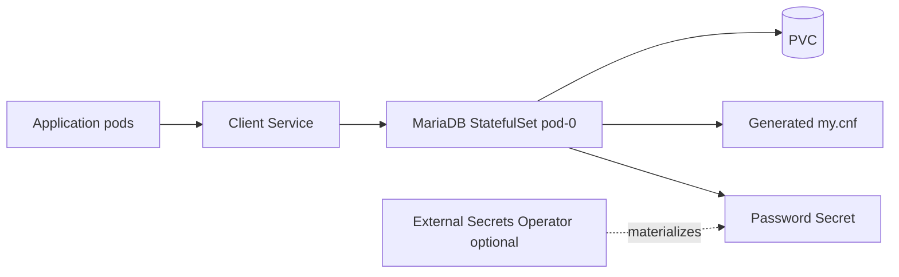
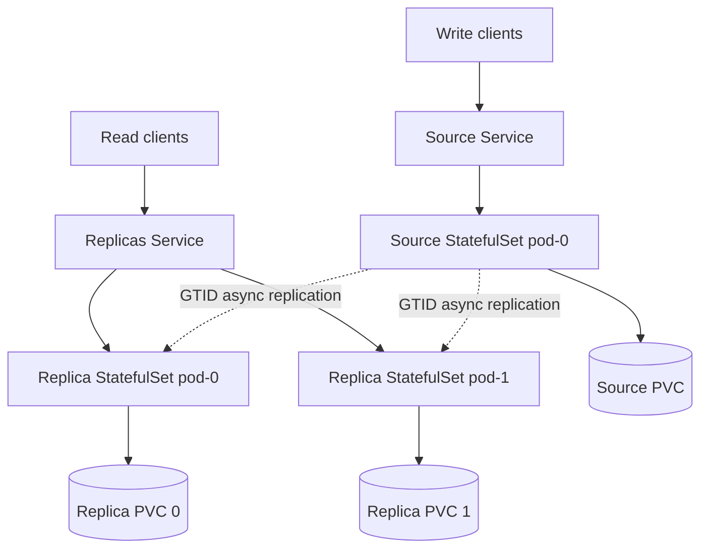

# MariaDB Chart Design

## Scope

This chart provides MariaDB deployments for Kubernetes using the official
MariaDB image. It supports two operating modes:

- `standalone`: one writable MariaDB pod backed by one PVC
- `replication`: one fixed writable source plus asynchronous read replicas

The chart focuses on practical Helm-native operation. It does not implement
operator-style failover, promotion, fencing, or automated data migration.

## Architecture: Standalone



Standalone mode is intended for development, internal services, and production
workloads where restore-based recovery is acceptable.

## Architecture: Replication



Replication mode is read scaling and recovery assistance, not automatic HA. The
source is fixed and promotion remains an operational procedure outside this
chart.

## Datadir Mount Strategy

The chart mounts the MariaDB datadir at `/var/lib/mysql` from
`persistence.subPath` by default. This keeps ext4 `lost+found` out of the
datadir on new PVCs.

Default:

```yaml
persistence:
  subPath: mysql
  prepareDataDir:
    enabled: false
```

Legacy behavior for existing installations:

```yaml
persistence:
  subPath: ""
```

This is intentionally global instead of per-role. A single setting keeps
standalone, source, and replica data paths consistent and avoids unnecessary API
surface.

The default path relies on `podSecurityContext.fsGroup` with
`fsGroupChangePolicy: OnRootMismatch` and does not render a root initContainer.
This keeps `persistence.subPath` compatible with Pod Security `restricted`.

`persistence.prepareDataDir.enabled=true` is an explicit escape hatch for
storage drivers that do not honor `fsGroup` on subPath directories. It renders a
root initContainer with `CHOWN` and `FOWNER`, so it requires a Pod Security
exception and is not part of the default path.

## Production Controls

Production installations should explicitly configure:

- `auth.existingSecret`
- `externalSecrets.enabled`
- `tls.enabled`
- `networkPolicy.enabled`
- `backup.enabled`
- `metrics.enabled`
- `resources` or resource presets
- scheduling constraints and disruption budgets

## Non-Goals

- automatic source promotion
- failover orchestration
- fencing or split-brain prevention
- online data migration between datadir layouts
- bundled proxy/router layer
- installing External Secrets Operator or Prometheus Operator

<!-- @AI-METADATA
type: design
title: MariaDB Chart Design
description: Design document for the MariaDB Helm chart with standalone, replication, and datadir subPath decisions

keywords: mariadb, design, replication, datadir, subPath, lost+found

purpose: Document architecture, design choices, production controls, and non-goals for the MariaDB chart
scope: Chart

relations:
  - charts/mariadb/values.yaml
  - charts/mariadb/templates/statefulset-source.yaml
  - charts/mariadb/templates/statefulset-replicas.yaml
path: charts/mariadb/DESIGN.md
version: 1.0
date: 2026-06-02
-->
