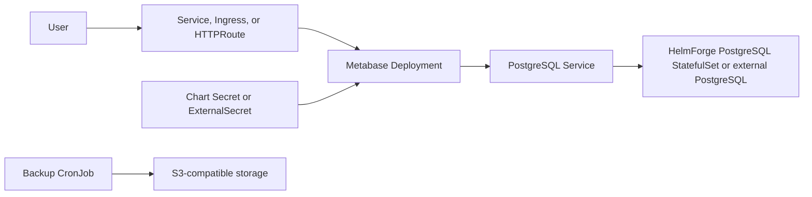

# Metabase Chart Design

## Scope

This chart deploys Metabase Open Source using the official `docker.io/metabase/metabase` image and a PostgreSQL metadata
store. It targets self-hosted analytics teams that need a predictable Kubernetes deployment with optional ingress,
Gateway API, External Secrets, dual-stack Services, and S3-compatible database backups.

Supported persistence modes:

- bundled HelmForge PostgreSQL subchart
- external PostgreSQL with inline or Secret-managed credentials

## Architecture

## Main Design Choices

- Use PostgreSQL as the metadata database for every mode; H2 is intentionally not used for chart defaults.
- Use the HelmForge PostgreSQL subchart when `postgresql.enabled=true`.
- Generate or reference `MB_ENCRYPTION_SECRET_KEY` so saved database credentials stay decryptable across upgrades.
- Keep Metabase AI features disabled by default to avoid background AI work without an explicitly configured provider.
- Render Gateway API and External Secrets only when explicitly enabled.
- Provide S3-compatible metadata database backups through a chart-managed CronJob.

## Production Boundary

For production, operators should define:

- PostgreSQL storage class, size, backup, and restore procedures
- stable `MB_ENCRYPTION_SECRET_KEY` through an existing Secret or External Secret
- `metabase.siteUrl` and TLS-enabled ingress or Gateway API routing
- resource requests and limits sized for dashboard and query load
- backup S3 endpoint, bucket, credentials, and retention workflow
- NetworkPolicy and ServiceMonitor settings when required by the platform

## Explicit Non-Goals

- provisioning analytical source databases
- managing Metabase setup wizard state or admin users
- running embedded H2 as a production metadata store
- provisioning ingress controllers, Gateway controllers, SecretStores, or object storage

<!-- @AI-METADATA
type: design
title: Metabase Chart Design
description: Design document for the Metabase Helm chart architecture, database model, backups, and production boundaries

keywords: metabase, design, architecture, postgresql, backup, ingress, gateway-api, external-secrets, helm, kubernetes

purpose: Document chart architecture, operational choices, production boundaries, and non-goals
scope: Chart Design

relations:
  - charts/metabase/README.md
  - charts/metabase/docs/database.md
  - charts/metabase/docs/production.md
path: charts/metabase/DESIGN.md
version: 1.0
date: 2026-06-02
-->
