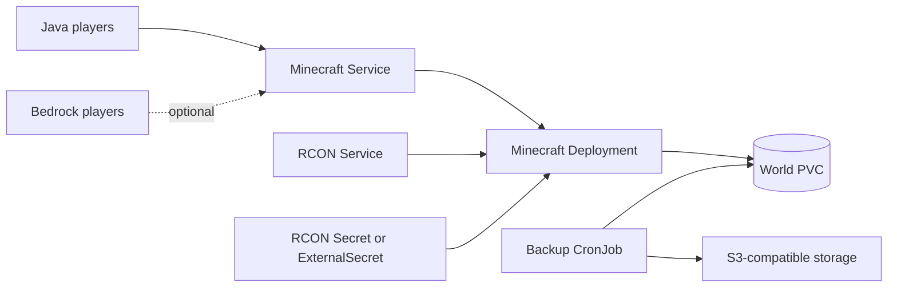

# Minecraft Chart Design

## Scope

This chart deploys Minecraft Java Edition servers using the official community-standard
`docker.io/itzg/minecraft-server` image. It supports vanilla, Paper, Forge, Fabric, Quilt, Geyser/Floodgate cross-play,
RCON operations, persistent worlds, metrics, External Secrets, and S3-compatible backups.

## Architecture

The workload intentionally uses a single replica with `Recreate` strategy because one Minecraft server process owns the
world data at a time.

## Main Design Choices

- Use `itzg/minecraft-server` because it handles server type selection, modloader bootstrap, version pinning, and startup
  automation.
- Require explicit `server.eula=true` before a server can run.
- Keep persistent world storage enabled by default.
- Expose the game service as `LoadBalancer` by default, with dual-stack service controls available.
- Keep RCON enabled for operational automation, backups, and graceful save coordination.
- Use External Secrets only when explicitly enabled and require an existing RCON secret to avoid credential drift.
- Use the same `itzg/minecraft-server` image for backup worker jobs so RCON tooling stays aligned with the server image.

## Production Boundary

For production, operators should define:

- `server.version`, `server.type`, and mod/plugin versions
- storage class, PVC size, and restore runbook
- service exposure, firewall rules, and optional DNS
- RCON secret management
- backup schedule, object storage credentials, and retention policy
- resource requests and memory/JVM settings appropriate for player count and modpack size
- staging validation for plugins, mods, datapacks, and resource packs before reusing production PVCs

## Explicit Non-Goals

- managing Bedrock Dedicated Server as a separate product
- running multiple Minecraft server replicas against one world
- provisioning object storage or external secret stores
- validating third-party mod/plugin compatibility
- bypassing the Minecraft EULA acceptance requirement
