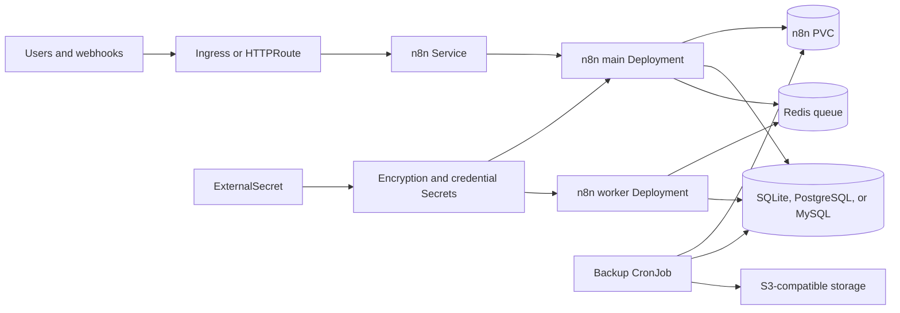

# n8n Chart Design

## Scope

This chart deploys n8n for self-hosted workflow automation. It supports the
zero-configuration SQLite path, HelmForge-managed PostgreSQL or MySQL, external
databases, Redis-backed queue mode, worker replicas, persistent data, ingress,
Gateway API, External Secrets, and S3-compatible backup jobs.

## Architecture

## Main Design Choices

- Use the upstream `docker.io/n8nio/n8n` image and pin explicit release tags.
- Keep SQLite as the default so small installations can start without subcharts.
- Use HelmForge PostgreSQL, MySQL, and Redis subcharts when operators enable
  managed dependencies.
- Auto-detect database mode from external database settings and enabled
  subcharts, while still allowing explicit `database.mode` overrides.
- Keep the encryption key in a Kubernetes Secret and support External Secrets as
  the single source of truth when `encryptionKey.existingSecret` is set.
- Run n8n containers as the upstream non-root node user with dropped Linux
  capabilities, RuntimeDefault seccomp, and resource requests/limits by default.
- Model queue mode as a separate worker Deployment so the main UI/webhook pod
  and background execution workers can be scaled independently.
- Use `emptyDir` for worker data by default so queue mode does not contend for a
  `ReadWriteOnce` main data PVC during scheduling.
- Make workers wait for main readiness before starting so fresh installs do not
  race n8n database migrations.
- Use external task runner mode with a generated shared token by default so n8n
  does not try to launch the unavailable internal Python runner from the base
  image.
- Retain the deprecated `gateway` block only as a backward-compatible alias for
  existing releases; new configuration should use `gatewayAPI`.
- Include database-aware backup scripts for SQLite, PostgreSQL, and MySQL.

## Production Boundary

For production, operators should define:

- a stable `n8n.encryptionKey` or existing Secret before first workflow use
- PostgreSQL or MySQL instead of SQLite for larger or multi-pod deployments
- Redis and worker sizing when queue mode is enabled
- webhook/editor URLs that match the public ingress or Gateway endpoint
- resource requests and limits for main, worker, backup, database, and Redis pods
- persistent storage classes and backup retention
- External Secrets integration for encryption, database, Redis, and S3 credentials
- staging validation for migrations before reusing production PVCs

## Explicit Non-Goals

- provisioning external databases, object storage, secret stores, or ingress
  controllers
- managing n8n Cloud features or licensing
- running Python task runners inside the base n8n application image
- guaranteeing compatibility for every third-party node package or custom node
- replacing upstream n8n migration and upgrade guidance

<!-- @AI-METADATA
type: design
title: n8n Chart Design
description: Design document for the n8n Helm chart architecture, database modes, queue mode, backups, and production boundaries

keywords: n8n, design, workflow, automation, queue, redis, postgresql, mysql, sqlite, backup, helm, kubernetes

purpose: Document chart architecture, operational choices, production boundaries, and non-goals
scope: Chart Design

relations:
  - charts/n8n/README.md
  - charts/n8n/docs/database.md
  - charts/n8n/docs/queue-mode.md
  - charts/n8n/docs/backup.md
path: charts/n8n/DESIGN.md
version: 1.0
date: 2026-06-02
-->
