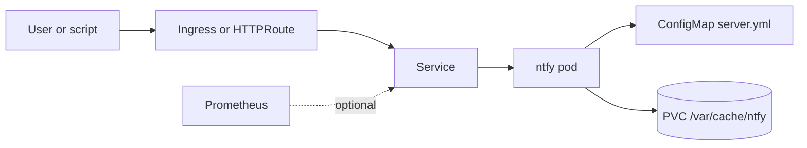

# ntfy Chart Design

## Scope

This chart deploys ntfy, a self-hosted HTTP pub-sub notification service.

Supported use cases:

- personal or team notification endpoints
- script-driven push notifications
- single-instance deployments backed by persistent SQLite storage
- ingress or Gateway API exposure for public HTTPS access
- optional Prometheus scraping through the ntfy metrics endpoint

## Architecture

## Design Choices

- Use the upstream `binwiederhier/ntfy` image.
- Keep the workload single-replica because ntfy stores cache and auth data in local SQLite files.
- Keep persistence enabled by default so message cache, attachments, and auth data survive restarts.
- Render Gateway API HTTPRoutes as an opt-in exposure path alongside Ingress.
- Keep Service dual-stack fields opt-in so clusters without dual-stack support use their defaults.
- Keep authentication user lifecycle out of the chart; ntfy users are managed with the upstream CLI.

## Production Boundary

Recommended production controls:

- set `ntfy.baseUrl` to the public HTTPS URL clients will use
- enable authentication and set `ntfy.authDefaultAccess: deny-all` for private deployments
- keep persistence enabled with a durable storage class
- back up the PVC before upgrades
- expose the service only through trusted ingress or Gateway policy
- set explicit resources for shared clusters

## Non-Goals

- multi-replica SQLite coordination
- user account reconciliation
- installing Gateway API CRDs or controllers
- installing Prometheus Operator CRDs

## Validation

The chart is expected to pass:

- Helm lint and strict lint
- Helm template rendering for default and CI values
- helm-unittest coverage for deployment, service, persistence, ingress, Gateway API, and metrics
- kubeconform validation for Kubernetes-native default manifests
- local k3d deployment smoke tests with pod logs and namespace events checked

<!-- @AI-METADATA
type: design
title: ntfy Chart Design
description: Design document for the ntfy Helm chart covering single-instance SQLite storage, exposure paths, metrics, and validation.
keywords: ntfy, notifications, helm, sqlite, gateway-api, prometheus
purpose: Document chart architecture, boundaries, and operational decisions.
scope: Chart Design
relations:
  - charts/ntfy/README.md
  - charts/ntfy/docs/configuration.md
path: charts/ntfy/DESIGN.md
version: 1.0
date: 2026-06-10
-->
