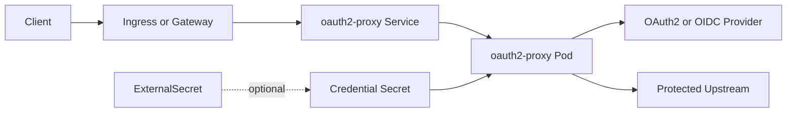

# OAuth2 Proxy Chart Design

## Goals

- Deploy the official OAuth2 Proxy image with secure Kubernetes defaults.
- Keep credentials flexible through chart-managed Secrets, existing Secrets, or ExternalSecret.
- Support both Ingress and Gateway API with a single HelmForge-standard `gateway` values block.
- Make reverse-proxy deployments safer by exposing explicit `trustedProxyIps` configuration.
- Validate rendered configuration before the workload starts by running `oauth2-proxy --config-test`.

## Architecture

## Security Defaults

- Pods run as non-root with dropped Linux capabilities and runtime default seccomp.
- The ServiceAccount token is not mounted by default.
- Cookies are secure by default; local examples explicitly disable this only for HTTP testing.
- `reverse_proxy` is enabled for Kubernetes edge use cases, but `trusted_proxy_ips` is empty by default so operators must opt in to trusted forwarding ranges.
- The init container validates the final OAuth2 Proxy configuration and uses the same image, args, env, mounts, and security context as the runtime container.

## Networking

- Ingress uses `ingress.ingressClassName`, matching HelmForge chart conventions.
- Gateway API support uses only the standard `gateway` values block.
- Services expose `ipFamilyPolicy` and `ipFamilies` for dual-stack clusters.

## Explicit Non-Goals

- This chart does not deploy an identity provider. Pair it with Keycloak, Authelia, Dex, or an external OAuth2/OIDC provider.
- This chart does not deploy Redis session storage by default; use OAuth2 Proxy extra args/env with a HelmForge Redis release when that mode is required.
