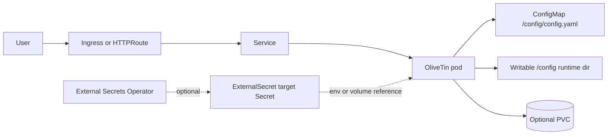

# OliveTin Chart Design

## Scope

This chart deploys OliveTin as a lightweight web UI for running predefined operational commands from Kubernetes.

Supported use cases:

- simple internal runbook panels
- household and homelab automation
- platform self-service actions with explicitly defined commands
- read-only dashboards backed by custom OliveTin configuration

The chart defaults to a single Deployment replica because OliveTin stores runtime session data in local files. Operators that need replicated frontends should verify their own configuration, authentication, and session behavior before increasing replicas through custom manifests.

## Architecture

## Design Choices

- Use the upstream `jamesread/olivetin` image.
- Keep the default config minimal and safe so the pod starts without requiring user-provided commands.
- Mount the chart-managed OliveTin configuration read-only while creating a writable runtime config directory for session and theme files.
- Use a `Recreate` strategy because the default deployment is single-instance and command execution should stay predictable.
- Provide Ingress and Gateway API as separate optional exposure paths.
- Keep ExternalSecret support generic. OliveTin does not require a built-in credential, but users commonly inject command credentials, API tokens, or webhook secrets through `extraEnv`, `extraVolumes`, and `extraVolumeMounts`.
- Keep Service dual-stack fields opt-in so clusters without dual-stack support keep their default behavior.

## Security Boundary

OliveTin runs commands configured by the chart user. The chart can apply Kubernetes hardening, but it cannot make unsafe commands safe.

Recommended production controls:

- define commands explicitly in `config`
- run with the default non-root security context
- avoid mounting host paths or broad service account permissions
- use External Secrets Operator for command credentials
- expose the UI only through authenticated ingress, Gateway API policy, or a trusted network boundary
- set explicit resources and scheduling rules for shared clusters

## Non-Goals

- command authorization policy beyond OliveTin configuration
- installing External Secrets Operator
- installing Gateway API CRDs or Gateway controllers
- managing shell scripts outside the mounted OliveTin configuration
- multi-replica session coordination

## Validation

The chart is expected to pass:

- Helm lint and strict lint
- Helm template rendering for default and CI values
- helm-unittest coverage
- kubeconform validation for Kubernetes-native default manifests
- local k3d deployment smoke tests with pod logs and namespace events checked

<!-- @AI-METADATA
type: design
title: OliveTin Chart Design
description: Design document for the OliveTin Helm chart covering architecture, security boundaries, Gateway API, External Secrets, and validation.
keywords: olivetin, helm, gateway-api, external-secrets, runbook, automation
purpose: Document chart architecture, explicit tradeoffs, and operational boundaries.
scope: Chart Design
relations:
  - charts/olivetin/README.md
  - charts/olivetin/docs/configuration.md
path: charts/olivetin/DESIGN.md
version: 1.0
date: 2026-06-02
-->
