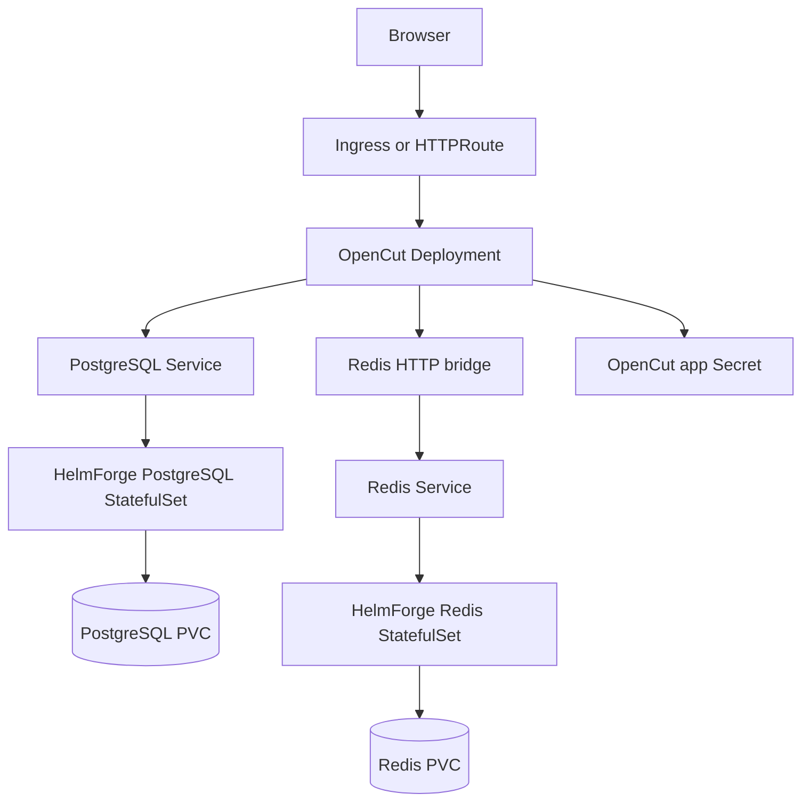
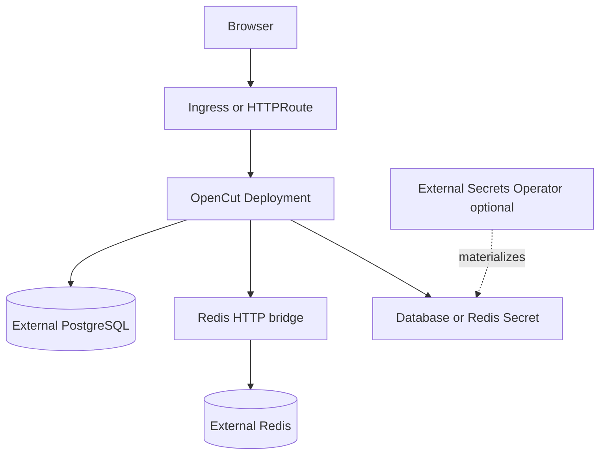

# OpenCut Chart Design

## Scope

This chart deploys OpenCut as a Helm-native web application with the supporting
services OpenCut expects at runtime.

Supported dependency modes:

- bundled HelmForge PostgreSQL and Redis subcharts for turnkey installs
- external PostgreSQL and external Redis for platform-managed data services
- Redis-over-HTTP bridge for OpenCut `UPSTASH_REDIS_REST_*` compatibility

The chart intentionally avoids installing platform controllers such as Ingress,
Gateway API, External Secrets Operator, storage provisioners, or monitoring
stacks.

## Architecture: Bundled Dependencies

Bundled mode is appropriate for local environments, preview environments, and
small installations where the release should own the complete runtime.

## Architecture: Platform Services

Platform-service mode is preferred when database backup, restore, patching, and
credential ownership are managed outside the release.

## Main Design Choices

- Use a HelmForge-maintained OpenCut image so the chart can pin a reproducible
  runtime and publish SBOM/signing evidence with the HelmForge release process.
- Use HelmForge PostgreSQL and Redis subcharts instead of third-party
  dependencies so database behavior, guardrails, and values remain consistent.
- Keep the Redis HTTP bridge explicit because the upstream application consumes
  HTTP-style Redis environment variables.
- Use a single `gateway` values block for Gateway API HTTPRoute support.
- Derive `opencut.siteUrl` from Ingress or Gateway hostnames only when the user
  does not set it directly.
- Keep application credentials in Secrets and support External Secrets for
  externally owned PostgreSQL credentials.

## Explicit Non-Goals

- video transcoding workers outside the upstream OpenCut web runtime
- bundled object storage
- installing Gateway API CRDs, Ingress controllers, or External Secrets Operator
- managing external PostgreSQL or Redis lifecycle
- automatic database migrations outside the OpenCut application startup path

## Production Boundary

Production users should provide explicit values for:

- `opencut.siteUrl`
- `opencut.betterAuthSecret`
- PostgreSQL and Redis credentials through existing Secrets or External Secrets
- persistence sizes and storage classes
- CPU and memory resources
- `networkPolicy.enabled=true`
- TLS through Ingress or Gateway infrastructure

<!-- @AI-METADATA
type: design
title: OpenCut Chart Design
description: Design document for the OpenCut Helm chart architecture, dependency modes, and production boundaries
keywords: opencut, design, architecture, postgresql, redis, gateway-api
purpose: Document chart design choices and operational boundaries
scope: Chart Design
relations:
  - charts/opencut/README.md
  - charts/opencut/docs/production.md
  - charts/opencut/docs/external-services.md
path: charts/opencut/DESIGN.md
version: 1.0
date: 2026-05-29
-->
