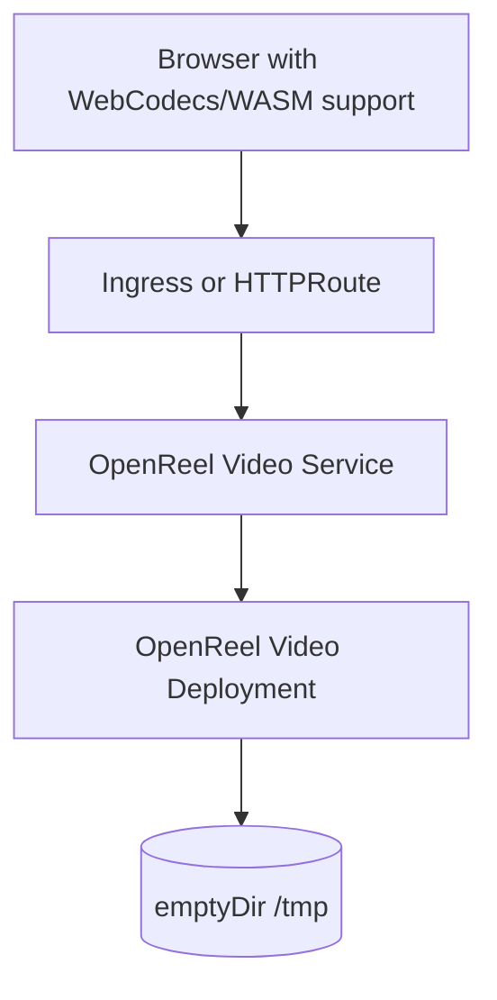

# OpenReel Video Chart Design

## Scope

This chart deploys OpenReel Video as a static browser application served by the
HelmForge-maintained image.

Supported exposure modes:

- ClusterIP Service with port-forward access
- Ingress with `ingress.ingressClassName`
- Gateway API HTTPRoute through the single `gateway` values block
- ExternalName Service when a platform needs a compatibility Service record

## Architecture

The workload is intentionally stateless. User media processing happens in the
browser and the chart does not deploy background workers, databases, object
storage, or queues.

## Main Design Choices

- Use the HelmForge-maintained `docker.io/helmforge/openreel-video` image.
- Keep the runtime non-root and read-only, with a small `/tmp` emptyDir for
  NGINX temporary files.
- Use one Gateway API values block named `gateway`, matching other HelmForge
  application charts.
- Use `ingress.ingressClassName`, matching the consolidated HelmForge values
  convention.
- Keep COOP/COEP behavior in the image so browser APIs such as
  SharedArrayBuffer, WebCodecs, and WASM workflows work behind common
  Kubernetes routing layers.

## Explicit Non-Goals

- server-side rendering
- user authentication
- persistent media storage
- background encoding workers
- database, cache, queue, or object-storage subcharts
- installing Ingress controllers or Gateway API CRDs

<!-- @AI-METADATA
type: design
title: OpenReel Video Chart Design
description: Design document for the OpenReel Video Helm chart architecture and scope
keywords: openreel-video, design, static-site, webcodecs, gateway-api
purpose: Document chart design choices and non-goals
scope: Chart Design
relations:
  - charts/openreel-video/README.md
  - charts/openreel-video/docs/production.md
path: charts/openreel-video/DESIGN.md
version: 1.0
date: 2026-05-29
-->
