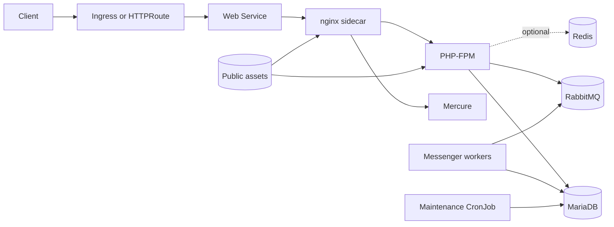

# Pimcore Chart Design

## Scope

The chart deploys Pimcore's real runtime topology while keeping application
project ownership explicit. It supports a pinned skeleton bootstrap for
evaluation and immutable project images for production.

## Architecture

## Design decisions

- The chart never claims that `pimcore/pimcore` contains an application.
- Bootstrap is pinned to skeleton `2026.2.0` and guarded by project
  persistence; production uses an immutable project image.
- Registration values stay in Secrets and are mandatory for the installer.
- nginx and PHP-FPM share one pod and a prepared project volume, matching their
  tight file-system coupling.
- Workers and maintenance use the same project image and environment contract.
- MariaDB uses the exact upstream collation requirement.
- RabbitMQ is a first-class dependency because Pimcore Studio and scheduled
  operations rely on Messenger transports.
- Redis is optional because the skeleton does not consume it by default.
- Mercure is internal and proxied through `/hub`.
- OpenSearch stays external and project-controlled.
- Health endpoints distinguish runtime health from application installation.

## Production boundary

The chart does not build application code, register Pimcore, provision
OpenSearch, configure project bundles, or create external databases/object
stores. These are application or infrastructure lifecycle concerns.

## Storage

Bootstrap project persistence and public assets are separate. The project PVC
is a convenience for evaluation, not an HA source-code distribution system.
Production definitions and generated classes should be versioned and baked
into the image. Public assets need RWX or external storage before scaling.

## Failure handling

- Init containers wait for MariaDB and RabbitMQ.
- The project preparation step is idempotent.
- Messenger workers recycle on upstream memory/time limits.
- Maintenance uses `Forbid` concurrency.
- Installer jobs have explicit deadlines and do not retry indefinitely.
- Template validation rejects unsafe or incomplete configurations early.

## Security

Workloads run without ServiceAccount tokens, privilege escalation, or Linux
capabilities. Secrets are consumed by reference. DSNs are assembled inside the
container to avoid placing passwords in rendered manifests.

## Non-goals

- Automatic product-key registration
- Runtime Composer installation in production
- Managing Pimcore data models or content
- Bundling OpenSearch
- Pretending a health endpoint means the database has been installed
