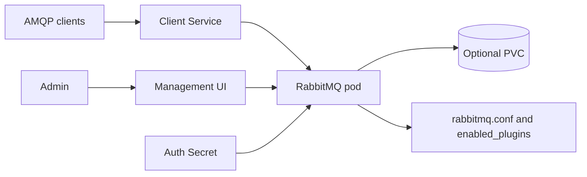
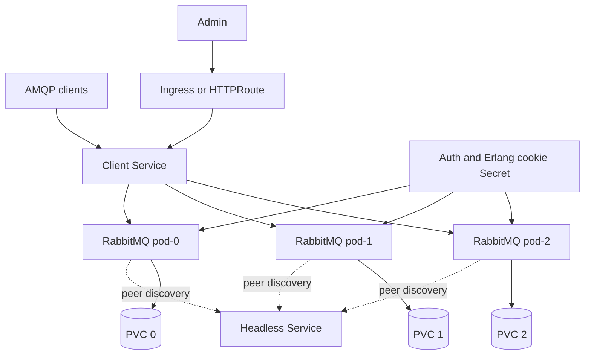

# RabbitMQ Chart Design

## Scope

This chart deploys RabbitMQ with explicit `single-node` and `cluster` architectures.

Supported use cases:

- single broker for development, staging, and simple internal workloads
- replicated RabbitMQ cluster for production messaging with quorum queues
- Management UI exposure through Ingress or Gateway API
- credential management through chart-managed Secrets, existing Secrets, or External Secrets Operator
- metrics through the native RabbitMQ Prometheus plugin and optional ServiceMonitor

## Architecture: Single Node

Single-node mode is operationally simple and intentionally does not claim broker failover.

## Architecture: Cluster

Cluster mode uses `rabbitmq_peer_discovery_k8s` and stable StatefulSet pod identities. It provides broker redundancy, but applications still need correct queue declarations and client reconnect behavior.

## Design Choices

- Use the official `rabbitmq` Alpine image and let chart values control enabled plugins.
- Keep `architecture` explicit instead of inferring topology from replica count.
- Use quorum queues by default because they are RabbitMQ's production direction for replicated queues.
- Disable Erlang scheduler busy-wait by default to keep idle CPU low in containerized environments.
- Use TCP probes against the active AMQP listener by default to avoid recurring `rabbitmq-diagnostics` VM startup cost.
- Keep generated `rabbitmq.conf` readable and allow controlled appends through `config.extra`.
- Require a stable Erlang cookie for clustering and upgrades.
- Require `auth.existingSecret` when `externalSecrets.enabled=true` to avoid drift between chart-generated and operator-reconciled credentials.
- Keep Gateway API focused on the Management UI. AMQP exposure remains Service-based because HTTPRoute is not the right protocol surface for AMQP.
- Do not switch image tags based on `management.enabled`; the default Alpine image already contains the management plugin, and `enabled_plugins` is the authoritative plugin surface.
- Keep dual-stack Service fields opt-in.

## Production Boundary

Recommended production baseline:

- `architecture=cluster`
- `cluster.replicaCount >= 3`
- persistence enabled for every broker
- stable credentials from `auth.existingSecret` or External Secrets Operator
- `queueDefaults.type=quorum`
- `metrics.enabled=true`
- `pdb.enabled=true`
- pod distribution with affinity or topology spread constraints
- TLS for clients outside trusted internal networks

## Non-Goals

- operator-like day-2 lifecycle automation
- automatic policy, federation, shovel, or topology orchestration
- backup or restore automation
- AMQP Gateway API routes
- hiding RabbitMQ queue design and client reconnect requirements

## Validation

The chart is expected to pass:

- Helm lint and strict lint
- Helm template rendering for default and CI values
- helm-unittest coverage for services, secrets, StatefulSet, PDB, Gateway API, and ExternalSecret
- kubeconform validation for Kubernetes-native default manifests
- local k3d deployment smoke tests with broker diagnostics, Management API, pod logs, and namespace events checked

<!-- @AI-METADATA
type: design
title: RabbitMQ Chart Design
description: Design document for the RabbitMQ Helm chart covering single-node, cluster, Gateway API, External Secrets, and operational boundaries.
keywords: rabbitmq, design, architecture, cluster, quorum, gateway-api, external-secrets
purpose: Document chart architecture, production boundary, and non-goals.
scope: Chart Design
relations:
  - charts/rabbitmq/README.md
  - charts/rabbitmq/docs/single-node.md
  - charts/rabbitmq/docs/cluster.md
path: charts/rabbitmq/DESIGN.md
version: 1.1
date: 2026-06-02
-->
