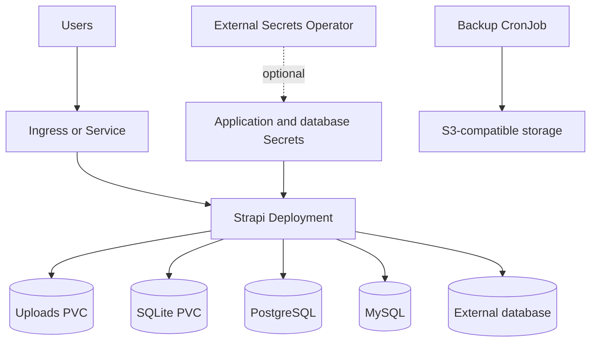

# Strapi Chart Design

## Scope

This chart deploys a prebuilt Strapi project image as a Kubernetes workload with
SQLite, bundled PostgreSQL, bundled MySQL, or external database support. It also
provides uploads persistence, optional ingress, External Secrets integration,
and scheduled backup jobs.

The chart is intended for teams that build or extend a Strapi application image
outside the cluster and want a repeatable Kubernetes runtime contract.

## Architecture

## Main Design Choices

- Keep the default deployment simple with the HelmForge Strapi base image and
  SQLite persistence.
- Support PostgreSQL and MySQL through bundled HelmForge dependencies while
  also allowing existing managed databases.
- Preserve generated application secrets across upgrades unless users provide
  an existing Secret.
- Keep uploads on a single PVC by default because local filesystem uploads are
  not shared safely across replicas.
- Make S3 and Cloudinary upload providers explicit opt-in choices for
  multi-replica deployments.
- Render ExternalSecret resources only when explicitly enabled; this chart does
  not install External Secrets Operator or manage provider-side stores.
- Keep backup jobs opt-in and focused on database dumps and S3-compatible
  upload targets.

## Production Boundary

Production users should set explicit values for:

- `image.repository` and `image.tag` for their Strapi project image
- `database.mode` and database credentials
- `secrets.existingSecret` or all application secret values
- `strapi.url`
- `resources`
- `persistence.size` and storage class settings
- `ingress` or another routing layer
- object storage upload provider for multi-replica deployments
- backup S3 credentials when `backup.enabled` is true

## Non-Goals

- Building Strapi source code inside Kubernetes
- Installing or configuring External Secrets Operator
- Provisioning cloud databases, buckets, or DNS records
- Making local filesystem uploads safe for multi-replica deployments
- Managing Strapi content types, plugins, or application code

<!-- @AI-METADATA
type: design
title: Strapi Chart Design
description: Design document for the Strapi Helm chart

keywords: strapi, cms, headless-cms, design, database, backup

purpose: Document architecture, chart boundaries, and production choices for Strapi
scope: Chart Design

relations:
  - charts/strapi/README.md
  - charts/strapi/docs/database.md
  - charts/strapi/docs/backup.md
path: charts/strapi/DESIGN.md
version: 1.0
date: 2026-06-11
-->
