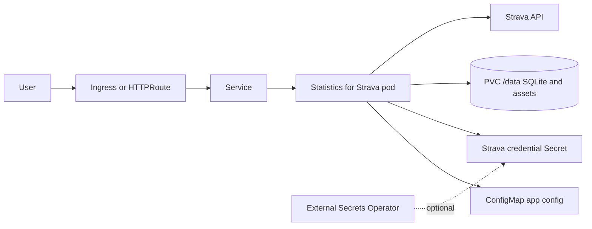

# Statistics for Strava Chart Design

## Scope

This chart deploys Statistics for Strava, a self-hosted dashboard for importing and visualizing Strava activities.

Supported use cases:

- personal fitness dashboards
- single-user or household Strava analytics
- SQLite-backed self-hosted deployments
- Strava OAuth credential management through chart values, existing Secrets, or External Secrets Operator

## Architecture

## Design Choices

- Use the upstream `robiningelbrecht/strava-statistics` image.
- Keep the deployment single-replica because SQLite is single-writer and the upstream app is not designed for horizontal scaling with shared writes.
- Keep persistence enabled by default because imports, generated assets, and SQLite data are stateful.
- Render Gateway API HTTPRoutes as an opt-in HTTP exposure path alongside Ingress.
- Keep the deprecated `gatewayApi` alias only for compatibility; new values should use `gatewayAPI`.
- Render ExternalSecret resources only when requested. The chart does not install External Secrets Operator or provider-side SecretStores.
- Keep Service dual-stack fields opt-in so clusters without dual-stack support keep default behavior.

## Production Boundary

Recommended production controls:

- provide Strava credentials through `strava.existingSecret` or External Secrets Operator
- configure a public `strava.config.general.appUrl` that matches the OAuth callback URL
- keep persistence enabled with a durable storage class
- back up the PVC before upgrades
- expose the UI only through an authenticated ingress/Gateway policy or trusted network
- set explicit resources for shared clusters

## Non-Goals

- multi-replica SQLite coordination
- external database support
- Strava OAuth app creation
- installing Gateway API CRDs or controllers
- installing External Secrets Operator

## Validation

The chart is expected to pass:

- Helm lint and strict lint
- Helm template rendering for default and CI values
- helm-unittest coverage for config, secrets, service, ingress, Gateway API, ExternalSecret, PVC, and deployment
- kubeconform validation for Kubernetes-native default manifests
- local k3d deployment smoke tests with pod logs and namespace events checked

<!-- @AI-METADATA
type: design
title: Statistics for Strava Chart Design
description: Design document for the Statistics for Strava Helm chart covering SQLite constraints, OAuth credentials, Gateway API, External Secrets, and validation.
keywords: strava, statistics, helm, sqlite, gateway-api, external-secrets
purpose: Document chart architecture, boundaries, and operational decisions.
scope: Chart Design
relations:
  - charts/strava-statistics/README.md
  - charts/strava-statistics/docs/configuration.md
path: charts/strava-statistics/DESIGN.md
version: 1.0
date: 2026-06-02
-->
