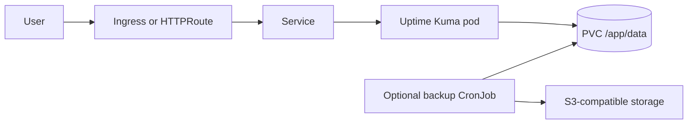
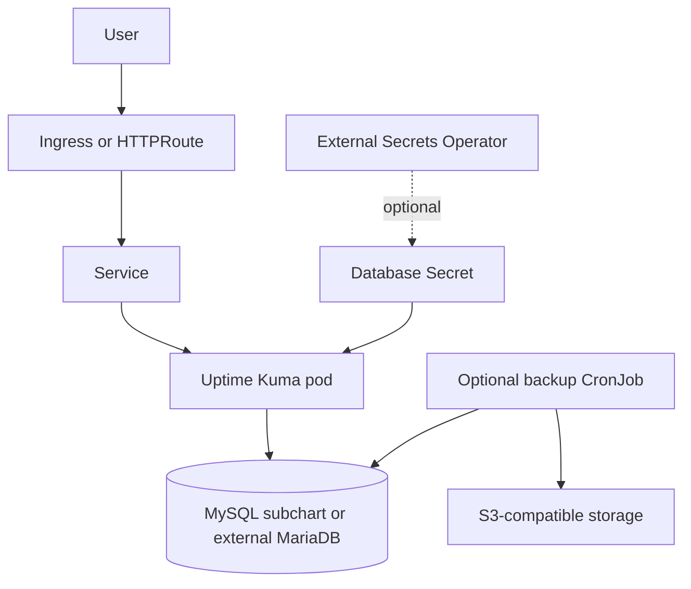

# Uptime Kuma Chart Design

## Scope

This chart deploys Uptime Kuma for self-hosted uptime monitoring, status pages, and notifications.

Supported data paths:

- SQLite under `/app/data` with a PVC
- MariaDB-compatible backend through the HelmForge MySQL subchart
- external MariaDB-compatible database

## Architecture: SQLite

SQLite mode follows upstream defaults and is the simplest path for most small installations.

## Architecture: MariaDB-Compatible Backend

The bundled database path uses the HelmForge MySQL chart as a MariaDB-compatible backend. External database mode lets platform teams own database lifecycle and backup outside this release.

## Design Choices

- Use the upstream `louislam/uptime-kuma` image.
- Keep SQLite as the default because it matches upstream defaults and avoids mandatory dependencies.
- Use the HelmForge MySQL subchart for bundled MariaDB-compatible deployments.
- Keep ExternalSecret support generic so operators can materialize database, backup, or notification credentials while wiring them through existing chart values.
- Provide Ingress and Gateway API exposure paths for the web dashboard and status pages.
- Keep Service dual-stack fields opt-in.
- Keep backup as a chart-managed CronJob using `helmforge/mc` for S3-compatible uploads.

## Production Boundary

Recommended production controls:

- keep persistence enabled for SQLite
- set an explicit durable storage class
- back up `/app/data` or the MariaDB database before upgrades
- use `database.external.existingSecret` or External Secrets Operator for database credentials
- use `backup.s3.existingSecret` or External Secrets Operator for S3 credentials
- expose the dashboard through authenticated ingress/Gateway policy or trusted networks
- set explicit resources in shared clusters

## Non-Goals

- operator-managed database lifecycle
- HA SQLite
- automatic monitor export/import
- installing Gateway API CRDs or controllers
- installing External Secrets Operator

## Validation

The chart is expected to pass:

- Helm dependency build
- Helm lint and strict lint
- Helm template rendering for default and CI values
- helm-unittest coverage for service, ingress, Gateway API, ExternalSecret, secrets, deployment, PVC, backup, and ServiceAccount
- kubeconform validation for Kubernetes-native default manifests
- local k3d deployment smoke tests for SQLite and bundled MySQL paths with pod logs and namespace events checked

<!-- @AI-METADATA
type: design
title: Uptime Kuma Chart Design
description: Design document for the Uptime Kuma Helm chart covering SQLite, MariaDB-compatible backend, backups, Gateway API, External Secrets, and validation.
keywords: uptime-kuma, monitoring, sqlite, mariadb, gateway-api, external-secrets, backup
purpose: Document chart architecture, operational boundaries, and validation expectations.
scope: Chart Design
relations:
  - charts/uptime-kuma/README.md
  - charts/uptime-kuma/docs/database.md
  - charts/uptime-kuma/docs/backup.md
path: charts/uptime-kuma/DESIGN.md
version: 1.0
date: 2026-06-02
-->
