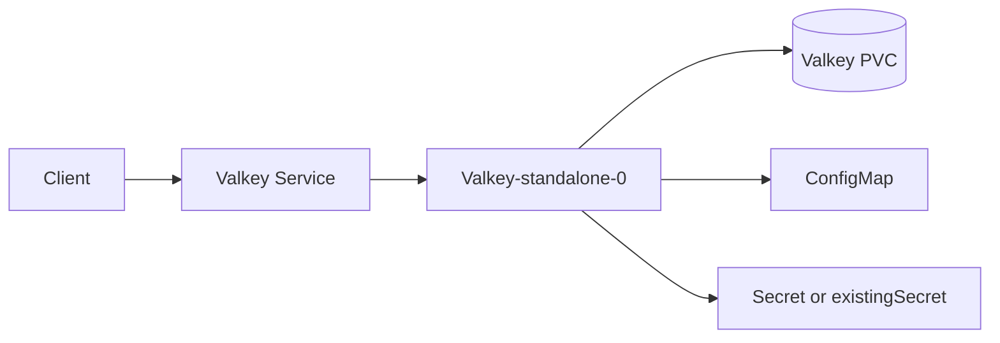
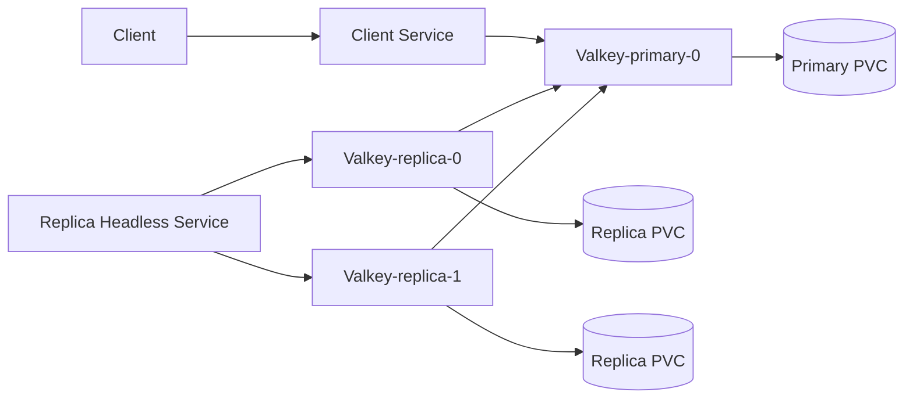
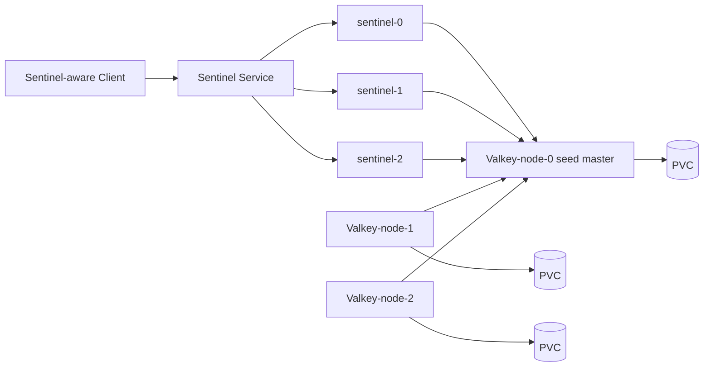
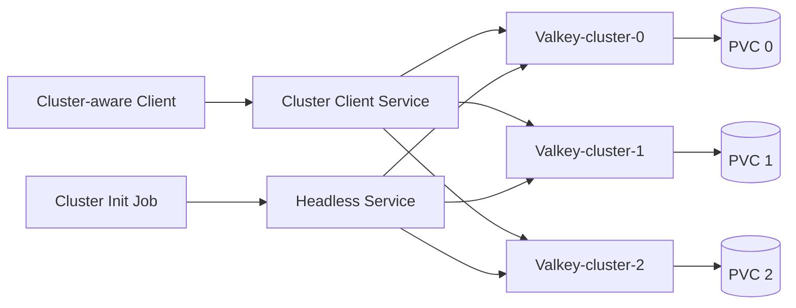

<!-- SPDX-License-Identifier: Apache-2.0 -->

# Valkey Chart Design

Status: implemented and maintained

Date: 2026-05-05

## Goal

The Valkey chart provides explicit, production-oriented Valkey topologies without hiding operational tradeoffs behind generic StatefulSet defaults. The chart supports four runtime contracts:

- `standalone`
- `replication`
- `sentinel`
- `cluster`

Each mode renders a different Kubernetes resource model because each mode has different client behavior, failover expectations, persistence patterns, and operational risk.

## Design Principles

- Make topology the first decision through `architecture`.
- Keep Valkey data-plane resources separate from optional observability and extension resources.
- Prefer stable DNS names for internal Valkey discovery instead of pod IPs.
- Support custom Kubernetes cluster domains through `clusterDomain`.
- Keep services dual-stack capable through `service.ipFamilyPolicy` and `service.ipFamilies`.
- Keep authentication explicit and reusable through generated Secrets, `existingSecret`, or External Secrets Operator integration.
- Use StatefulSets for Valkey data nodes to preserve stable identities and storage.
- Use startup checks where Valkey role discovery depends on another component becoming reachable.
- Make generated names predictable through shared helpers.
- Keep chart validation representative by covering every supported topology in CI values and unit tests.

## Topology Selection

```yaml
architecture: standalone | replication | sentinel | cluster
```

Use `standalone` for development, small environments, caches where downtime is acceptable, or single-node production scenarios with external recovery procedures.

Use `replication` when applications can read from replicas or when operators want a primary/replica layout without Sentinel-managed failover.

Use `sentinel` when applications expect a single writable primary and can integrate with Sentinel discovery/failover.

Use `cluster` when applications are Valkey Cluster aware and need sharding at the Valkey protocol level.

## Architecture Diagrams

### Standalone



Standalone keeps the resource graph intentionally small. It is easy to operate, but it has no in-chart failover target.

### Replication



Replication separates primary and replica StatefulSets. This keeps role-specific configuration and persistence clear, and lets operators tune scheduling, resources, and storage per role.

### Sentinel



Sentinel is a distinct architecture because it changes the client contract. Data nodes are role-neutral peers; Sentinel pods monitor the elected master and can promote any data node after failover. Sentinel pods wait for the seed master before startup and use hostname resolution (`resolve-hostnames` and `announce-hostnames`) so custom cluster domains work consistently.

Data node bootstrap queries Sentinel first, then probes peer `INFO replication` when Sentinel is unreachable. This prevents split-brain on pod reschedule without PVCs. `node.persistence.enabled` defaults to `false`; enable persistence when RDB/AOF must survive reschedules. Persisted nodes fail closed when neither Sentinel nor peers can confirm the role.

### Valkey Cluster



Cluster mode uses stable pod FQDNs for `cluster-announce-hostname` and a bootstrap Job for initial cluster creation.
It does not try to replace dedicated Valkey Cluster operational tooling for resharding or complex node replacement.

## Kubernetes Resource Model

### Shared Resources

- `Secret` or references to `existingSecret`
- optional `ExternalSecret`
- `ConfigMap`
- client and headless `Service` resources
- optional `ServiceMonitor`
- optional `PodDisruptionBudget`
- optional `extraManifests`

### Standalone Resources

- one Valkey StatefulSet
- one PVC per pod when persistence is enabled
- one client Service

### Replication Resources

- primary StatefulSet
- replica StatefulSet
- primary and replica DNS helpers
- role-specific persistence

### Sentinel Resources

- role-neutral Valkey node StatefulSet (`node.replicaCount`)
- Sentinel StatefulSet (`sentinel.replicaCount`, independently scaled)
- Sentinel service
- Sentinel configuration with hostname resolution
- startup wait loop for seed master reachability
- client discovery exclusively through Sentinel (no `-primary` Service)

### Cluster Resources

- Valkey Cluster StatefulSet
- headless service for stable pod DNS
- client service for cluster-aware clients
- bootstrap Job
- per-node persistence

## DNS And Cluster Domain

Valkey internals must not hardcode `svc.cluster.local`. The chart centralizes FQDN generation in helper templates and uses:

```yaml
clusterDomain: cluster.local
```

Operators running clusters with a non-default domain can set `clusterDomain` once and have replication, Sentinel, Cluster announce names, bootstrap jobs, and NOTES output use the same domain.

## Service Networking

Services support single-stack and dual-stack clusters through Kubernetes service family fields:

```yaml
service:
  ipFamilyPolicy: PreferDualStack
```

Best practices:

- Leave the defaults empty unless the cluster supports the requested families.
- Use `PreferDualStack` for portable dual-stack behavior.
- Set explicit `ipFamilies` only in environment-specific values for clusters that advertise every requested family.
- Use `RequireDualStack` only when both families are guaranteed.
- Keep headless and client services aligned so DNS behavior is predictable.

## Security Model

- Authentication is enabled by default for production-oriented usage.
- `existingSecret` avoids chart-owned credential rotation when an external secret manager is authoritative.
- External Secrets Operator integration lets the chart reference externally managed credentials while still rendering Kubernetes-native Secret consumers.
- Pods run with restricted security contexts by default where Valkey compatibility allows it.
- Metrics sidecars and the cluster initialization Job have their own container security context values so all chart-managed pods can satisfy Pod Security Admission `restricted`.
- The chart avoids privileged containers and host namespace access.
- Sensitive values should not be embedded in examples, CI values, or NOTES.

## Persistence

Stateful Valkey nodes use PVCs because identity and data continuity matter for Valkey operations.

Best practices:

- Use persistence for production data-bearing nodes.
- Keep storage class and size explicit in production values.
- Disable persistence only for tests, ephemeral caches, or local k3d validation.
- Treat backup/restore as an application-level operational procedure, not as an implicit chart side effect.

## Scheduling And Availability

HA topologies should spread pods across nodes and failure domains where the cluster has enough capacity.

Recommended production controls:

- pod anti-affinity for Valkey replicas and Sentinel pods
- topology spread constraints across zones or hosts
- PodDisruptionBudgets for HA modes
- explicit resource requests and limits
- node selectors or tolerations only when they reflect real platform policy

## Observability

Metrics are optional and should be enabled only when the Prometheus Operator or a compatible scraper is present.

When enabled, exporter resources should follow the selected architecture, use the metrics-specific container security
context, and expose a stable ServiceMonitor target. The chart should not render CRDs owned by observability operators.

## Extension Points

The chart exposes extension points for advanced operators without making them required:

- `extraEnv`
- `extraVolumes`
- `extraVolumeMounts`
- `extraManifests`
- pod annotations and labels
- service annotations
- topology-specific resource overrides

Extension points are escape hatches. Common operational paths should remain first-class values with schema validation.

## Validation Strategy

Every change to the chart should keep the following checks passing:

- `helm dependency build charts/valkey`
- `helm lint charts/valkey --strict`
- `helm unittest charts/valkey`
- `helm template valkey charts/valkey`
- `helm template valkey charts/valkey -f charts/valkey/ci/*.yaml`
- strict Kubernetes schema validation for default and CI renders
- documentation linting for changed Markdown files
- runtime k3d validation for behavior-changing chart changes

The CI values must cover standalone, replication, sentinel, cluster, metrics, existing secrets, and networking variants that affect rendered resources.

## Non-Goals

- Valkey Enterprise or active-active Valkey
- arbitrary Valkey modules as first-class chart features
- operator-grade resharding or node replacement automation
- hiding Valkey Cluster complexity from non-cluster-aware clients
- rendering third-party CRDs owned by other operators

## Related Documents

- [`README.md`](README.md)
- [`values.yaml`](values.yaml)
- [`values.schema.json`](values.schema.json)
- [`templates/NOTES.txt`](templates/NOTES.txt)
