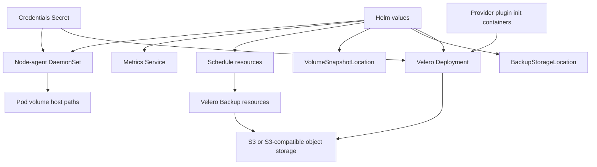

# Velero Chart Design

## Scope

The Velero chart installs the upstream Velero server with the official
`docker.io/velero/velero` image, optional provider plugin init containers,
Velero CRDs, backup storage locations, snapshot locations, schedules, metrics,
and the optional node-agent DaemonSet for filesystem backup.

The chart is intentionally explicit about storage and credentials. Operators
must provide a working object storage bucket and credentials before depending on
the release for disaster recovery.

## Architecture

## Design Choices

### Official upstream images

The chart uses the official Velero server image and the official AWS provider
plugin image by default. Additional plugin init containers are exposed through
`plugins.extra` so users can add provider-specific integrations without the
chart inventing provider abstractions.

### CRDs are packaged with the chart

Velero is CRD-driven. The chart keeps Velero CRDs in `crds/` so Helm installs
them before rendering `BackupStorageLocation`, `VolumeSnapshotLocation`, and
`Schedule` resources.

### Object storage is mandatory for useful backups

Velero backups are stored through `BackupStorageLocation` resources. The
default values render a placeholder S3-compatible configuration and require the
operator to provide a bucket, endpoint when needed, and credentials.

### Filesystem backup is opt-in

Velero filesystem backup requires the node-agent DaemonSet. The official Velero
documentation describes node-agent as the component that hosts filesystem backup
modules such as Kopia. This chart keeps it disabled by default because it needs
hostPath access to pod volume directories and runs as root by design.

### Snapshots stay provider-specific

`VolumeSnapshotLocation` resources are rendered from values, but the chart does
not infer cloud provider configuration. Snapshot support depends on the
installed Velero plugin and storage platform capabilities.

## Production Boundaries

- Validate `BackupStorageLocation` health before enabling schedules.
- Enable `nodeAgent.enabled` only after confirming hostPath and Pod Security
  expectations for the target cluster.
- Use `configuration.defaultVolumesToFsBackup=true` only when filesystem backup
  should be the default for pod volumes.
- Keep DR clusters in `configuration.restoreOnlyMode=true` when they should not
  create new backups.
- Set resource requests and limits based on backup concurrency and repository
  size.
- Treat inline `credentials.secretContents` as a bootstrap path; production
  environments should prefer a pre-created Secret or platform secret manager
  workflow.

## Observability

Velero exposes metrics through the chart-managed Service when `metrics.enabled`
is true. `metrics.serviceMonitor.enabled` creates a Prometheus Operator
ServiceMonitor when that CRD is available in the cluster.

Operational signals to watch:

- `BackupStorageLocation` availability
- backup and restore phase transitions
- node-agent readiness on nodes that host protected PVCs
- failed or partially failed backups
- repository maintenance and upload/download failures
- schedules creating backups at the expected cadence

## Failure Domains

| Failure Domain | Chart Boundary | Operator Responsibility |
|----------------|----------------|-------------------------|
| Object storage outage | BSL resource renders provider config | operate durable bucket and endpoint |
| Credential rotation | Secret reference or inline Secret | rotate credentials and restart Velero if required |
| PVC data protection | node-agent DaemonSet | enable filesystem backup or snapshots deliberately |
| Snapshot provider drift | VSL resource renders provider config | install and maintain matching Velero plugin |
| Schedule scope mistakes | Schedule resource renders template | review namespaces, selectors, TTL, and volume mode |

## Non-Goals

- Installing object storage such as MinIO.
- Installing Prometheus Operator.
- Managing cloud IAM identities.
- Creating backup buckets.
- Generating provider credentials.
- Abstracting every Velero provider into first-class values.

## References

- [Velero documentation](https://velero.io/docs/)
- [File System Backup](https://velero.io/docs/main/file-system-backup/)
- [Backup Storage Locations and Volume Snapshot Locations](https://velero.io/docs/main/locations/)
- [Customize Velero Install](https://velero.io/docs/main/customize-installation/)
