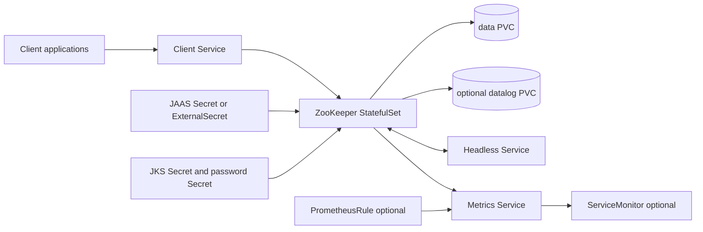

# ZooKeeper Chart Design

## Scope

This chart deploys Apache ZooKeeper with the official
`docker.io/library/zookeeper` image. It is designed for Kubernetes-native
coordination ensembles that need stable pod identity, persistent state,
controlled quorum traffic, optional SASL client authentication, optional secure
client ports, and Prometheus-compatible monitoring.

The chart owns the ZooKeeper server process and Kubernetes resources around it.
It does not install client applications, Kafka, Prometheus Operator, External
Secrets Operator, certificate issuers, or backup controllers.

## Architecture

The StatefulSet uses stable pod DNS through the headless Service. Each pod is
assigned a ZooKeeper server ID from its StatefulSet ordinal and renders
`server.N=host:follower:election;client` entries for every replica. For
`replicaCount=1`, the chart can run standalone mode when
`zookeeper.standaloneEnabled=true`.

## Main Design Choices

- Use a StatefulSet because ZooKeeper requires stable network identity and
  durable local state.
- Default to three replicas because ZooKeeper availability depends on a
  majority quorum and odd ensemble sizes avoid wasted members.
- Fail fast on even replica counts unless `allowEvenReplicas=true` is set.
- Keep persistence enabled by default and support a separate transaction log
  PVC through `persistence.dataLogDir`.
- Use the official image entrypoint, but generate the runtime environment and
  `zoo.cfg` inputs through a chart-managed ConfigMap.
- Keep SASL/Digest client authentication optional and represent it as a JAAS
  Secret or ExternalSecret-managed material.
- Require user-provided JKS material for TLS instead of generating private keys
  inside the chart.
- Expose the ZooKeeper Prometheus metrics provider only when
  `metrics.enabled=true`.
- Keep NetworkPolicy opt-in so development clusters remain easy to test while
  production values can explicitly restrict client, quorum, metrics, and DNS
  traffic.

## Production Boundary

Production deployments should keep an odd replica count, usually three or five
members. A three-member ensemble tolerates one failed server; a five-member
ensemble tolerates two. Even replica counts are intentionally blocked by
default because they do not improve failure tolerance compared with the next
lower odd size.

Persistent storage is part of the ZooKeeper data plane. The chart creates one
data PVC per pod and can create a second transaction log PVC per pod. Operators
should choose a storage class with predictable latency and should test pod
rescheduling before promotion.

## Security Boundary

The chart hardens the container with non-root execution, dropped Linux
capabilities, disabled privilege escalation, and no ServiceAccount token mount
by default. It does not make ZooKeeper authentication mandatory because many
internal platform deployments still rely on network isolation. Production
clusters should combine NetworkPolicy, SASL or TLS where clients support it,
and restricted four-letter command whitelists.

## Observability Boundary

ZooKeeper can be monitored through four-letter commands, `zkServer.sh status`,
JMX, and the Prometheus metrics provider. This chart exposes the Prometheus
provider and can render ServiceMonitor and PrometheusRule resources when the
Prometheus Operator CRDs are available.

## Current Gaps and Improvement Candidates

- Add quorum TLS support when the value contract can model rolling migration
  with `portUnification` safely.
- Add richer PrometheusRule defaults for quorum loss, follower lag, and request
  latency once metric names are validated across supported ZooKeeper versions.
- Add documented backup and restore workflows for snapshots and transaction
  logs.
- Add explicit client examples for common consumers such as Kafka and Solr
  without coupling those workloads into this chart.

## Explicit Non-Goals

- Kafka, Solr, HBase, or other ZooKeeper clients
- certificate generation or cert-manager integration
- Prometheus Operator or External Secrets Operator installation
- automated quorum TLS migration
- cross-cluster replication
- snapshot backup controller lifecycle
